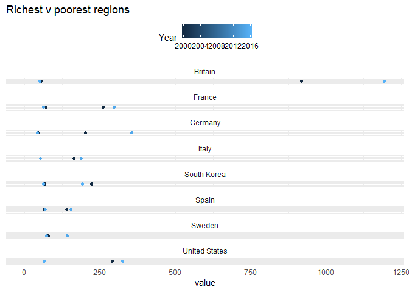
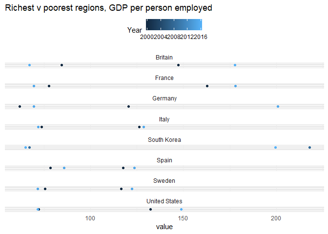

OECD regional inequality 2018
================

A primer on regional inequality and data

Set up, load in libraries

``` r
#path <- your.path.to.our.repo
#setwd(path)

#libs
libs <- c("tidyverse", "dtplyr", "data.table", "OECD", "knitr", "countrycode")
lapply(libs, require, character.only=T)
```

    ## Loading required package: tidyverse

    ## -- Attaching packages ------------------------------------------------------------------------------------------------------------------------------------- tidyverse 1.2.1 --

    ## v ggplot2 3.0.0     v purrr   0.2.4
    ## v tibble  1.4.2     v dplyr   0.7.5
    ## v tidyr   0.8.1     v stringr 1.3.1
    ## v readr   1.1.1     v forcats 0.3.0

    ## -- Conflicts ---------------------------------------------------------------------------------------------------------------------------------------- tidyverse_conflicts() --
    ## x dplyr::filter() masks stats::filter()
    ## x dplyr::lag()    masks stats::lag()

    ## Loading required package: dtplyr

    ## Loading required package: data.table

    ## 
    ## Attaching package: 'data.table'

    ## The following objects are masked from 'package:dplyr':
    ## 
    ##     between, first, last

    ## The following object is masked from 'package:purrr':
    ## 
    ##     transpose

    ## Loading required package: OECD

    ## Loading required package: knitr

    ## Loading required package: countrycode

    ## [[1]]
    ## [1] TRUE
    ## 
    ## [[2]]
    ## [1] TRUE
    ## 
    ## [[3]]
    ## [1] TRUE
    ## 
    ## [[4]]
    ## [1] TRUE
    ## 
    ## [[5]]
    ## [1] TRUE
    ## 
    ## [[6]]
    ## [1] TRUE

The OECD data we're going to work with is available here: <https://stats.oecd.org/Index.aspx?DataSetCode=REGION_DEMOGR#>

These files are massive and complex. We've downloaded the data in advance and made it available in the repo's "inputs" folder.

Let's read in the file and inspect the vars

``` r
reg.dat <- fread("inputs/oecd_raw_dat.csv")

#Inspect the data, by code and descriptor var pairs
reg.dat[, .N, .(TL, Territory.Level.and.Typology)] #TL level
```

    ##      TL              Territory.Level.and.Typology     N
    ## 1:    2                       Large regions (TL2) 34074
    ## 2: 3_PU Small regions (TL3) - predominantly urban 23097
    ## 3: 3_IN        Small regions (TL3) - intermediate 33806
    ## 4: 3_PR Small regions (TL3) - predominantly rural 27371
    ## 5:    1                                   Country  3120
    ## 6:  NOG                        Non Official Grids  7384

``` r
reg.dat[, .N, .(REG_ID, Region)] #Region
```

    ##        REG_ID                                     Region  N
    ##    1:    CO95                                   Guaviare 32
    ##    2:    ME30                                   Veracruz 42
    ##    3:   UKC13                                 Darlington 68
    ##    4:    PL42                             West Pomerania 68
    ##    5:    CZ06                                  Southeast 73
    ##   ---                                                      
    ## 2538: CA5980N               Northeast, British Columbia  18
    ## 2539: CA3580N        Stratford-Bruce Peninsula, Ontario  23
    ## 2540: CA5930N       Thompson-Okanagan, British Columbia  18
    ## 2541: CA5960N North Coast and Nechako, British Columbia  18
    ## 2542:    EU28                                      EU-28 17

``` r
reg.dat[, .N, .(SERIES, SNA.Classification)] #Series
```

    ##      SERIES                                     SNA.Classification      N
    ## 1: SNA_2008 Last SNA classification (SNA 2008 or latest available) 128852

``` r
reg.dat[, .N, .(VAR, Indicator)] #Indicator
```

    ##              VAR                                              Indicator
    ## 1:           GDP                                           Regional GDP
    ## 2: EMP_IND_TOTAL Regional Employment at place of work, total activities
    ## 3: GVA_IND_TOTAL           Regional Gross Value Added, total activities
    ##        N
    ## 1: 77576
    ## 2: 35434
    ## 3: 15842

``` r
reg.dat[, .N, .(MEAS, Measure)] #Measure
```

    ##           MEAS
    ## 1:    REAL_PPP
    ## 2: PC_REAL_PPP
    ## 3:         PER
    ## 4: PW_REAL_PPP
    ##                                                          Measure     N
    ## 1:   Millions USD, constant prices, constant PPP, base year 2010 39424
    ## 2:   USD per head, constant prices, constant PPP, base year 2010 38152
    ## 3:                                             Number of persons 35434
    ## 4: USD per worker, constant prices, constant PPP, base year 2010 15842

``` r
reg.dat[, .N, .(POS, Position)] #Position
```

    ##    POS    Position      N
    ## 1: ALL All regions 128852

``` r
reg.dat[, .N, .(TIME, Year)] %>% head() #time
```

    ##    TIME Year    N
    ## 1: 2006 2006 7550
    ## 2: 2010 2010 8004
    ## 3: 2002 2002 7064
    ## 4: 2005 2005 7548
    ## 5: 2000 2000 6896
    ## 6: 2008 2008 7746

``` r
reg.dat[, .N, .(Unit.Code, Unit)] #units
```

    ##    Unit.Code Unit      N
    ## 1:        NA   NA 128852

``` r
reg.dat[, .N, .(PowerCode.Code, PowerCode)] #powercode
```

    ##    PowerCode.Code PowerCode      N
    ## 1:              0     Units 128852

``` r
reg.dat[, .N, .(Reference.Period.Code, Reference.Period)] #ref period
```

    ##    Reference.Period.Code Reference.Period      N
    ## 1:                    NA               NA 128852

``` r
reg.dat[, .N, .(Flag.Codes, Flags)] #flags
```

    ##    Flag.Codes             Flags      N
    ## 1:                              122728
    ## 2:          E   Estimated value   6053
    ## 3:          B             Break     68
    ## 4:          P Provisional value      3

``` r
#We also need a names lookup file that we created
oecd.names <- fread("inputs/oecd_names_lookup.csv")
```

First let's explore all the measures in our dataset, for UK TL3 (small) areas alone

``` r
#---------- Which measure is best?  ----------------

#Check out the GDP measures
reg.dat[grepl("3", TL),] %>%
  .[, .(REG_ID, Region, VAR, Indicator, MEAS, Measure, Year, Value)] %>% .[, .N, .(VAR, MEAS, Measure)]
```

    ##              VAR        MEAS
    ## 1:           GDP    REAL_PPP
    ## 2:           GDP PC_REAL_PPP
    ## 3: EMP_IND_TOTAL         PER
    ## 4: GVA_IND_TOTAL PW_REAL_PPP
    ##                                                          Measure     N
    ## 1:   Millions USD, constant prices, constant PPP, base year 2010 25123
    ## 2:   USD per head, constant prices, constant PPP, base year 2010 24589
    ## 3:                                             Number of persons 23876
    ## 4: USD per worker, constant prices, constant PPP, base year 2010 10686

``` r
#Total GDP at TL3 (d1)
reg.dat[VAR == "GDP" & MEAS == "REAL_PPP" & grepl("3", TL),] %>%
  .[grepl("UK", REG_ID) & Year == 2016,] %>%
  .[, .(REG_ID, Region, Indicator, Measure, Year, Value)] %>%
  arrange(-Value) -> d1 #%>% kable(.)
head(d1) %>% kable
```

| REG\_ID | Region                  | Indicator    | Measure                                                     |  Year|     Value|
|:--------|:------------------------|:-------------|:------------------------------------------------------------|-----:|---------:|
| UKI31   | Camden & City of London | Regional GDP | Millions USD, constant prices, constant PPP, base year 2010 |  2016|  118544.0|
| UKI32   | Westminster             | Regional GDP | Millions USD, constant prices, constant PPP, base year 2010 |  2016|   85956.8|
| UKJ11   | Berkshire               | Regional GDP | Millions USD, constant prices, constant PPP, base year 2010 |  2016|   54412.0|
| UKH23   | Hertfordshire           | Regional GDP | Millions USD, constant prices, constant PPP, base year 2010 |  2016|   51721.6|
| UKI42   | Tower Hamlets           | Regional GDP | Millions USD, constant prices, constant PPP, base year 2010 |  2016|   40544.9|
| UKJ25   | West Surrey             | Regional GDP | Millions USD, constant prices, constant PPP, base year 2010 |  2016|   40006.6|

``` r
#GDP per person at TL3
reg.dat[VAR == "GDP" & MEAS == "PC_REAL_PPP" & grepl("3", TL),] %>%
  .[grepl("UK", REG_ID) & Year == 2016,] %>%
  .[, .(REG_ID, Region, Indicator, Measure, Year, Value)] %>%
  arrange(-Value) -> d2 #%>% kable(.)
head(d2) %>% kable
```

| REG\_ID | Region                                          | Indicator    | Measure                                                     |  Year|   Value|
|:--------|:------------------------------------------------|:-------------|:------------------------------------------------------------|-----:|-------:|
| UKI31   | Camden & City of London                         | Regional GDP | USD per head, constant prices, constant PPP, base year 2010 |  2016|  462774|
| UKI32   | Westminster                                     | Regional GDP | USD per head, constant prices, constant PPP, base year 2010 |  2016|  348497|
| UKI42   | Tower Hamlets                                   | Regional GDP | USD per head, constant prices, constant PPP, base year 2010 |  2016|  133380|
| UKI33   | Kensington and Chelsea & Hammersmith and Fulham | Regional GDP | USD per head, constant prices, constant PPP, base year 2010 |  2016|   99226|
| UKI43   | Haringey & Islington                            | Regional GDP | USD per head, constant prices, constant PPP, base year 2010 |  2016|   68542|
| UKJ12   | Milton Keynes                                   | Regional GDP | USD per head, constant prices, constant PPP, base year 2010 |  2016|   67779|

``` r
#Population by region (implicit)
full_join(d1, d2, by = c("REG_ID", "Region")) %>%
  .[, `:=`(Measure = "Population", Indicator = "Pop", Year = 2016, Value = Value.x * 10^6 / Value.y)] %>%
  .[, .(REG_ID, Region, Indicator, Measure, Year, Value)] %>%
  arrange(Value) -> d3
head(d3) %>% kable
```

| REG\_ID | Region                                                       | Indicator | Measure    |  Year|      Value|
|:--------|:-------------------------------------------------------------|:----------|:-----------|-----:|----------:|
| UKM65   | Orkney Islands                                               | Pop       | Population |  2016|   21699.98|
| UKM66   | Shetland Islands                                             | Pop       | Population |  2016|   23229.74|
| UKM64   | Eilean Siar (Western Isles)                                  | Pop       | Population |  2016|   26930.00|
| UKL11   | Isle of Anglesey                                             | Pop       | Population |  2016|   70029.82|
| UKM61   | Caithness & Sutherland and Ross & Cromarty                   | Pop       | Population |  2016|   94641.53|
| UKM63   | Lochaber, Skye & Lochalsh, Arran & Cumbrae and Argyll & Bute | Pop       | Population |  2016|  100171.32|

``` r
#Work-based employment
reg.dat[VAR == "EMP_IND_TOTAL" & grepl("3", TL),] %>%
  .[grepl("UK", REG_ID) & Year == 2016,] %>%
  .[, .(REG_ID, Region, Indicator, Measure, Year, Value)] %>%
  arrange(-Value) -> d4
head(d4) %>% kable
```

| REG\_ID | Region                  | Indicator                                              | Measure           |  Year|   Value|
|:--------|:------------------------|:-------------------------------------------------------|:------------------|-----:|-------:|
| UKI31   | Camden & City of London | Regional Employment at place of work, total activities | Number of persons |  2016|  833000|
| UKI32   | Westminster             | Regional Employment at place of work, total activities | Number of persons |  2016|  733000|
| UKH23   | Hertfordshire           | Regional Employment at place of work, total activities | Number of persons |  2016|  633000|
| UKJ11   | Berkshire               | Regional Employment at place of work, total activities | Number of persons |  2016|  541000|
| UKG31   | Birmingham              | Regional Employment at place of work, total activities | Number of persons |  2016|  526000|
| UKE42   | Leeds                   | Regional Employment at place of work, total activities | Number of persons |  2016|  468000|

``` r
#GDP per person employed
full_join(d1, d4, by = c("REG_ID", "Region")) %>%
  .[, `:=`(Measure = "GDP per person employed", Indicator = "GDP per person", Year = 2016, Value = Value.x * 10^6 / Value.y)] %>%
  .[, .(REG_ID, Region, Indicator, Measure, Year, Value)] %>%
  arrange(-Value) -> d5
head(d5) %>% kable
```

| REG\_ID | Region                                          | Indicator      | Measure                 |  Year|     Value|
|:--------|:------------------------------------------------|:---------------|:------------------------|-----:|---------:|
| UKI31   | Camden & City of London                         | GDP per person | GDP per person employed |  2016|  142309.7|
| UKI42   | Tower Hamlets                                   | GDP per person | GDP per person employed |  2016|  140780.9|
| UKI34   | Wandsworth                                      | GDP per person | GDP per person employed |  2016|  133785.2|
| UKI33   | Kensington and Chelsea & Hammersmith and Fulham | GDP per person | GDP per person employed |  2016|  124072.3|
| UKI32   | Westminster                                     | GDP per person | GDP per person employed |  2016|  117267.1|
| UKI43   | Haringey & Islington                            | GDP per person | GDP per person employed |  2016|  110759.0|

``` r
#Regional Gross Value Added (GDP ex. subsidies)
reg.dat[VAR == "GVA_IND_TOTAL" & MEAS == "PW_REAL_PPP" & grepl("3", TL),] %>%
  .[grepl("UK", REG_ID) & Year == 2016,] %>%
  .[, .(REG_ID, Region, Indicator, Measure, Year, Value)] %>%
  arrange(-Value) -> d6 #%>% kable(.)
head(d6) %>% kable
```

| REG\_ID | Region                          | Indicator                                    | Measure                                                       |  Year|  Value|
|:--------|:--------------------------------|:---------------------------------------------|:--------------------------------------------------------------|-----:|------:|
| UKJ11   | Berkshire                       | Regional Gross Value Added, total activities | USD per worker, constant prices, constant PPP, base year 2010 |  2016|  89927|
| UKD62   | Cheshire East                   | Regional Gross Value Added, total activities | USD per worker, constant prices, constant PPP, base year 2010 |  2016|  86294|
| UKJ12   | Milton Keynes                   | Regional Gross Value Added, total activities | USD per worker, constant prices, constant PPP, base year 2010 |  2016|  85188|
| UKJ13   | Buckinghamshire CC              | Regional Gross Value Added, total activities | USD per worker, constant prices, constant PPP, base year 2010 |  2016|  83464|
| UKM50   | Aberdeen City and Aberdeenshire | Regional Gross Value Added, total activities | USD per worker, constant prices, constant PPP, base year 2010 |  2016|  81222|
| UKM25   | Edinburgh, City of              | Regional Gross Value Added, total activities | USD per worker, constant prices, constant PPP, base year 2010 |  2016|  79607|

``` r
#n.b not available for all TL3 regions

rbindlist(l = list(d1, d2, d3, d4, d5, d6), fill=T) -> dat.uk
head(dat.uk) %>% kable
```

| REG\_ID | Region                  | Indicator    | Measure                                                     |  Year|     Value|
|:--------|:------------------------|:-------------|:------------------------------------------------------------|-----:|---------:|
| UKI31   | Camden & City of London | Regional GDP | Millions USD, constant prices, constant PPP, base year 2010 |  2016|  118544.0|
| UKI32   | Westminster             | Regional GDP | Millions USD, constant prices, constant PPP, base year 2010 |  2016|   85956.8|
| UKJ11   | Berkshire               | Regional GDP | Millions USD, constant prices, constant PPP, base year 2010 |  2016|   54412.0|
| UKH23   | Hertfordshire           | Regional GDP | Millions USD, constant prices, constant PPP, base year 2010 |  2016|   51721.6|
| UKI42   | Tower Hamlets           | Regional GDP | Millions USD, constant prices, constant PPP, base year 2010 |  2016|   40544.9|
| UKJ25   | West Surrey             | Regional GDP | Millions USD, constant prices, constant PPP, base year 2010 |  2016|   40006.6|

With this data gathered, let's see how things look in Camden & City of London versus the Isle of Angelsey:

``` r
#Grab Camden & Anglesey
dat.uk[grepl("Camden", Region),] %>% kable
```

| REG\_ID | Region                  | Indicator                                              | Measure                                                     |  Year|     Value|
|:--------|:------------------------|:-------------------------------------------------------|:------------------------------------------------------------|-----:|---------:|
| UKI31   | Camden & City of London | Regional GDP                                           | Millions USD, constant prices, constant PPP, base year 2010 |  2016|  118544.0|
| UKI31   | Camden & City of London | Regional GDP                                           | USD per head, constant prices, constant PPP, base year 2010 |  2016|  462774.0|
| UKI31   | Camden & City of London | Pop                                                    | Population                                                  |  2016|  256159.6|
| UKI31   | Camden & City of London | Regional Employment at place of work, total activities | Number of persons                                           |  2016|  833000.0|
| UKI31   | Camden & City of London | GDP per person                                         | GDP per person employed                                     |  2016|  142309.7|

``` r
dat.uk[grepl("Torbay", Region),] %>% kable
```

| REG\_ID | Region | Indicator                                              | Measure                                                       |  Year|      Value|
|:--------|:-------|:-------------------------------------------------------|:--------------------------------------------------------------|-----:|----------:|
| UKK42   | Torbay | Regional GDP                                           | Millions USD, constant prices, constant PPP, base year 2010   |  2016|    2900.62|
| UKK42   | Torbay | Regional GDP                                           | USD per head, constant prices, constant PPP, base year 2010   |  2016|   21663.00|
| UKK42   | Torbay | Pop                                                    | Population                                                    |  2016|  133897.43|
| UKK42   | Torbay | Regional Employment at place of work, total activities | Number of persons                                             |  2016|   54000.00|
| UKK42   | Torbay | GDP per person                                         | GDP per person employed                                       |  2016|   53715.19|
| UKK42   | Torbay | Regional Gross Value Added, total activities           | USD per worker, constant prices, constant PPP, base year 2010 |  2016|   48030.00|

``` r
#Comparing measures
dat.uk[REG_ID %in% c("UKL11", "UKI31"),] %>%
  dcast(Measure ~ Region, value.var = "Value") %>%
  rename(Camden.City=2, Anglesey=3) %>%
  mutate(mutiple = round(Camden.City / Anglesey, 3)) %>% kable(.)
```

| Measure                                                       |  Camden.City|  Anglesey|  mutiple|
|:--------------------------------------------------------------|------------:|---------:|--------:|
| GDP per person employed                                       |     142309.7|  60240.87|    2.362|
| Millions USD, constant prices, constant PPP, base year 2010   |     118544.0|   1385.54|   85.558|
| Number of persons                                             |     833000.0|  23000.00|   36.217|
| Population                                                    |     256159.6|  70029.82|    3.658|
| USD per head, constant prices, constant PPP, base year 2010   |     462774.0|  19785.00|   23.390|
| USD per worker, constant prices, constant PPP, base year 2010 |           NA|  53866.00|       NA|

The table above shows descriptive the values for each var, and the multiples between them.

Now, let's produce the same variables for every OECD country.

First we'll being with GDP per person:

``` r
#--------- Get GDP per person for different geographic areas ---------

#National 
reg.dat[VAR == "GDP" & MEAS == "PC_REAL_PPP" & TL == 1,] %>%
  .[!REG_ID %in% c("OECD"), .(REG_ID, Region, Measure, Year, Value)] %>%
  left_join(., rename(oecd.names, REG_ID = oecd.nat.code), by = "REG_ID") %>%
  .[, .(iso3c, REG_ID, Region, Measure, Year, Value)] -> dat2.nat

#GDP per person at TL2 
reg.dat[VAR == "GDP" & MEAS == "PC_REAL_PPP" & grepl("2", TL),] %>%
  .[, .(REG_ID, Region, Measure, Year, Value)] %>%
  .[, oecd.imp.code := substr(REG_ID, 1, 2)] %>%
  left_join(., oecd.names, by = "oecd.imp.code") -> dat2.tl2

#GDP per person at TL3 
reg.dat[VAR == "GDP" & MEAS == "PC_REAL_PPP" & grepl("3", TL),] %>%
  .[, .(REG_ID, Region, Measure, Year, Value)] %>%
  .[, oecd.imp.code := substr(REG_ID, 1, 2)] %>%
  left_join(., oecd.names, by = "oecd.imp.code") -> dat2.tl3
```

With the main data isolated, dat2, for national, tl2 and tl3, let's contstruct the plot data

First, the richest areas in each TL3 (TL2s for USA)

``` r
#--------- Richest regions ---------

print("Richest regions, latest data")
```

    ## [1] "Richest regions, latest data"

``` r
dat2.tl3[, .SD[which.max(Value)], by=.(iso3c, Year)] %>%
  .[, .SD[which.max(Year)], by=.(iso3c)] %>% 
  .[, geo := "richest.region"] %>%
  .[, .(iso3c, geo, REG_ID, Region, Measure, Year, Value)] %>%
  arrange(iso3c) -> d2.richest.latest

#Adding richest region in USA (TL2) to TL3 regions
dat2.tl2[, .SD[which.max(Value)], by=.(iso3c, Year)] %>%
  .[, .SD[which.max(Year)], by=.(iso3c)] %>% 
  .[, geo := "richest.region"] %>%
  .[iso3c == "USA", .(iso3c, geo, REG_ID, Region, Measure, Year, Value)] %>%
  bind_rows(., d2.richest.latest) %>% 
  arrange(iso3c) -> d2.richest.latest
d2.richest.latest %>% kable
```

| iso3c | geo            | REG\_ID | Region                                                  | Measure                                                     |  Year|   Value|
|:------|:---------------|:--------|:--------------------------------------------------------|:------------------------------------------------------------|-----:|-------:|
| AUT   | richest.region | AT323   | Salzburg und Umgebung                                   | USD per head, constant prices, constant PPP, base year 2010 |  2015|   55682|
| BEL   | richest.region | BE100   | Arr. de Bruxelles-Capitale / Arr. Van Brussel-Hoofdstad | USD per head, constant prices, constant PPP, base year 2010 |  2016|   69614|
| BGR   | richest.region | BG411   | Sofia (Stolitsa)                                        | USD per head, constant prices, constant PPP, base year 2010 |  2016|   37515|
| CHE   | richest.region | CH031   | Basel-Stadt                                             | USD per head, constant prices, constant PPP, base year 2010 |  2015|  116505|
| CYP   | richest.region | CY000   | Cyprus                                                  | USD per head, constant prices, constant PPP, base year 2010 |  2016|   30857|
| CZE   | richest.region | CZ010   | Prague                                                  | USD per head, constant prices, constant PPP, base year 2010 |  2016|   63467|
| DEU   | richest.region | DE211   | Ingolstadt Kreisfreie Stadt                             | USD per head, constant prices, constant PPP, base year 2010 |  2015|  151068|
| DNK   | richest.region | DK012   | Copenhagen suburbs                                      | USD per head, constant prices, constant PPP, base year 2010 |  2016|   72902|
| ESP   | richest.region | ES211   | Araba/Álava                                            | USD per head, constant prices, constant PPP, base year 2010 |  2015|   48792|
| EST   | richest.region | EE001   | North Estonia                                           | USD per head, constant prices, constant PPP, base year 2010 |  2016|   38701|
| FIN   | richest.region | FI1B1   | Helsinki-Uusimaa                                        | USD per head, constant prices, constant PPP, base year 2010 |  2015|   50253|
| FRA   | richest.region | FR105   | Hauts-de-Seine                                          | USD per head, constant prices, constant PPP, base year 2010 |  2015|  109111|
| GBR   | richest.region | UKI31   | Camden & City of London                                 | USD per head, constant prices, constant PPP, base year 2010 |  2016|  462774|
| GRC   | richest.region | EL303   | Central Athens                                          | USD per head, constant prices, constant PPP, base year 2010 |  2015|   46326|
| HRV   | richest.region | HR041   | City of Zagreb                                          | USD per head, constant prices, constant PPP, base year 2010 |  2015|   35091|
| HUN   | richest.region | HU101   | Budapest                                                | USD per head, constant prices, constant PPP, base year 2010 |  2016|   49870|
| IRL   | richest.region | IE023   | Mid-West                                                | USD per head, constant prices, constant PPP, base year 2010 |  2015|   44028|
| ITA   | richest.region | ITC4C   | Milan                                                   | USD per head, constant prices, constant PPP, base year 2010 |  2015|   61968|
| JPN   | richest.region | JPD13   | Tokyo                                                   | USD per head, constant prices, constant PPP, base year 2010 |  2014|   64169|
| KOR   | richest.region | KR022   | Ulsan                                                   | USD per head, constant prices, constant PPP, base year 2010 |  2016|   66798|
| LTU   | richest.region | LT00A   | Vilnius county                                          | USD per head, constant prices, constant PPP, base year 2010 |  2015|   37422|
| LUX   | richest.region | LU000   | Luxembourg                                              | USD per head, constant prices, constant PPP, base year 2010 |  2016|   88446|
| LVA   | richest.region | LV006   | Riga                                                    | USD per head, constant prices, constant PPP, base year 2010 |  2015|   37037|
| MLT   | richest.region | MT001   | Malta                                                   | USD per head, constant prices, constant PPP, base year 2010 |  2016|   34686|
| NLD   | richest.region | NL326   | Groot-Amsterdam                                         | USD per head, constant prices, constant PPP, base year 2010 |  2015|   84405|
| NOR   | richest.region | NO011   | Oslo                                                    | USD per head, constant prices, constant PPP, base year 2010 |  2016|   88338|
| NZL   | richest.region | NZ017   | Taranaki Region                                         | USD per head, constant prices, constant PPP, base year 2010 |  2016|   42849|
| POL   | richest.region | PL127   | City of Warsaw                                          | USD per head, constant prices, constant PPP, base year 2010 |  2015|   69573|
| PRT   | richest.region | PT181   | Alentejo Litoral                                        | USD per head, constant prices, constant PPP, base year 2010 |  2015|   39370|
| ROU   | richest.region | RO321   | Bucuresti                                               | USD per head, constant prices, constant PPP, base year 2010 |  2015|   53610|
| SVK   | richest.region | SK010   | Bratislava Region                                       | USD per head, constant prices, constant PPP, base year 2010 |  2016|   69485|
| SVN   | richest.region | SI041   | Central Slovenia                                        | USD per head, constant prices, constant PPP, base year 2010 |  2016|   40901|
| SWE   | richest.region | SE110   | Stockholm County                                        | USD per head, constant prices, constant PPP, base year 2010 |  2015|   62527|
| TUR   | richest.region | TR100   | Istanbul                                                | USD per head, constant prices, constant PPP, base year 2010 |  2014|   35779|
| USA   | richest.region | US11    | District of Columbia                                    | USD per head, constant prices, constant PPP, base year 2010 |  2016|  168688|

``` r
print("Richest regions in 2000, or earliest avail.")
```

    ## [1] "Richest regions in 2000, or earliest avail."

``` r
dat2.tl3[REG_ID %in% d2.richest.latest$REG_ID,] %>%
  .[Year >= 2000, .SD[which.min(Year)], by=.(iso3c)] %>%
  .[, geo := "richest.region"] %>%
  .[, .(iso3c, geo, REG_ID, Region, Measure, Year, Value)] %>%
  arrange(iso3c) -> d2.richest.earliest

#Adding in richest region in USA (TL2) in 2000 to TL3 regions in 2000
dat2.tl2[REG_ID %in% d2.richest.latest$REG_ID,] %>%
  .[Year >= 2000, .SD[which.min(Year)], by=.(iso3c)] %>%
  .[, geo := "richest.region"] %>%
  .[iso3c == "USA", .(iso3c, geo, REG_ID, Region, Measure, Year, Value)] %>%
  bind_rows(., d2.richest.earliest) %>% 
  arrange(iso3c) -> d2.richest.earliest
d2.richest.earliest %>% kable
```

| iso3c | geo            | REG\_ID | Region                                                  | Measure                                                     |  Year|   Value|
|:------|:---------------|:--------|:--------------------------------------------------------|:------------------------------------------------------------|-----:|-------:|
| AUT   | richest.region | AT323   | Salzburg und Umgebung                                   | USD per head, constant prices, constant PPP, base year 2010 |  2000|   46395|
| BEL   | richest.region | BE100   | Arr. de Bruxelles-Capitale / Arr. Van Brussel-Hoofdstad | USD per head, constant prices, constant PPP, base year 2010 |  2000|   71803|
| BGR   | richest.region | BG411   | Sofia (Stolitsa)                                        | USD per head, constant prices, constant PPP, base year 2010 |  2000|   14858|
| CHE   | richest.region | CH031   | Basel-Stadt                                             | USD per head, constant prices, constant PPP, base year 2010 |  2008|  113070|
| CYP   | richest.region | CY000   | Cyprus                                                  | USD per head, constant prices, constant PPP, base year 2010 |  2000|   29486|
| CZE   | richest.region | CZ010   | Prague                                                  | USD per head, constant prices, constant PPP, base year 2010 |  2000|   40885|
| DEU   | richest.region | DE211   | Ingolstadt Kreisfreie Stadt                             | USD per head, constant prices, constant PPP, base year 2010 |  2000|   71640|
| DNK   | richest.region | DK012   | Copenhagen suburbs                                      | USD per head, constant prices, constant PPP, base year 2010 |  2000|   56114|
| ESP   | richest.region | ES211   | Araba/Álava                                            | USD per head, constant prices, constant PPP, base year 2010 |  2000|   40792|
| EST   | richest.region | EE001   | North Estonia                                           | USD per head, constant prices, constant PPP, base year 2010 |  2000|   22222|
| FIN   | richest.region | FI1B1   | Helsinki-Uusimaa                                        | USD per head, constant prices, constant PPP, base year 2010 |  2000|   46715|
| FRA   | richest.region | FR105   | Hauts-de-Seine                                          | USD per head, constant prices, constant PPP, base year 2010 |  2000|   88946|
| GBR   | richest.region | UKI31   | Camden & City of London                                 | USD per head, constant prices, constant PPP, base year 2010 |  2000|  301433|
| GRC   | richest.region | EL303   | Central Athens                                          | USD per head, constant prices, constant PPP, base year 2010 |  2000|   37828|
| HRV   | richest.region | HR041   | City of Zagreb                                          | USD per head, constant prices, constant PPP, base year 2010 |  2001|   26943|
| HUN   | richest.region | HU101   | Budapest                                                | USD per head, constant prices, constant PPP, base year 2010 |  2000|   34402|
| IRL   | richest.region | IE023   | Mid-West                                                | USD per head, constant prices, constant PPP, base year 2010 |  2000|   34389|
| ITA   | richest.region | ITC4C   | Milan                                                   | USD per head, constant prices, constant PPP, base year 2010 |  2000|   57895|
| JPN   | richest.region | JPD13   | Tokyo                                                   | USD per head, constant prices, constant PPP, base year 2010 |  2001|   63061|
| KOR   | richest.region | KR022   | Ulsan                                                   | USD per head, constant prices, constant PPP, base year 2010 |  2000|   46097|
| LTU   | richest.region | LT00A   | Vilnius county                                          | USD per head, constant prices, constant PPP, base year 2010 |  2000|   17190|
| LUX   | richest.region | LU000   | Luxembourg                                              | USD per head, constant prices, constant PPP, base year 2010 |  2000|   76305|
| LVA   | richest.region | LV006   | Riga                                                    | USD per head, constant prices, constant PPP, base year 2010 |  2000|   18035|
| MLT   | richest.region | MT001   | Malta                                                   | USD per head, constant prices, constant PPP, base year 2010 |  2001|   24664|
| NLD   | richest.region | NL326   | Groot-Amsterdam                                         | USD per head, constant prices, constant PPP, base year 2010 |  2000|   67552|
| NOR   | richest.region | NO011   | Oslo                                                    | USD per head, constant prices, constant PPP, base year 2010 |  2000|   72418|
| NZL   | richest.region | NZ017   | Taranaki Region                                         | USD per head, constant prices, constant PPP, base year 2010 |  2000|   38172|
| POL   | richest.region | PL127   | City of Warsaw                                          | USD per head, constant prices, constant PPP, base year 2010 |  2000|   39546|
| PRT   | richest.region | PT181   | Alentejo Litoral                                        | USD per head, constant prices, constant PPP, base year 2010 |  2000|   30987|
| ROU   | richest.region | RO321   | Bucuresti                                               | USD per head, constant prices, constant PPP, base year 2010 |  2000|   23535|
| SVK   | richest.region | SK010   | Bratislava Region                                       | USD per head, constant prices, constant PPP, base year 2010 |  2000|   34115|
| SVN   | richest.region | SI041   | Central Slovenia                                        | USD per head, constant prices, constant PPP, base year 2010 |  2000|   30836|
| SWE   | richest.region | SE110   | Stockholm County                                        | USD per head, constant prices, constant PPP, base year 2010 |  2000|   50183|
| TUR   | richest.region | TR100   | Istanbul                                                | USD per head, constant prices, constant PPP, base year 2010 |  2001|   16153|
| USA   | richest.region | US11    | District of Columbia                                    | USD per head, constant prices, constant PPP, base year 2010 |  2000|  129778|

And repeat the steps above for the poorest regions

``` r
#--------- Poorest regions ------------

print("Poorest regions, latest data")
```

    ## [1] "Poorest regions, latest data"

``` r
dat2.tl3[!REG_ID %in% c("FRY50", "FRY30"), ] %>% #removing France's overseas departments
  .[, .SD[which.min(Value)], by=.(iso3c, Year)] %>% 
  .[, .SD[which.max(Year)], by=.(iso3c)] %>% 
  .[, geo := "poorest.region"] %>%
  .[, .(iso3c, geo, REG_ID, Region, Measure, Year, Value)] %>%
  arrange(iso3c) -> d2.poorest.latest

#Adding richest region in USA (TL2) to TL3 regions
dat2.tl2[, .SD[which.min(Value)], by=.(iso3c, Year)] %>%
  .[, .SD[which.max(Year)], by=.(iso3c)] %>% 
  .[, geo := "poorest.region"] %>%
  .[iso3c == "USA", .(iso3c, geo, REG_ID, Region, Measure, Year, Value)] %>%
  bind_rows(., d2.poorest.latest) %>% 
  arrange(iso3c) -> d2.poorest.latest
d2.poorest.latest %>% kable
```

| iso3c | geo            | REG\_ID | Region                      | Measure                                                     |  Year|  Value|
|:------|:---------------|:--------|:----------------------------|:------------------------------------------------------------|-----:|------:|
| AUT   | poorest.region | AT125   | Weinviertel                 | USD per head, constant prices, constant PPP, base year 2010 |  2015|  22734|
| BEL   | poorest.region | BE326   | Arr. Thuin                  | USD per head, constant prices, constant PPP, base year 2010 |  2016|  17408|
| BGR   | poorest.region | BG325   | Silistra                    | USD per head, constant prices, constant PPP, base year 2010 |  2016|   8012|
| CHE   | poorest.region | CH062   | Uri                         | USD per head, constant prices, constant PPP, base year 2010 |  2015|  36801|
| CYP   | poorest.region | CY000   | Cyprus                      | USD per head, constant prices, constant PPP, base year 2010 |  2016|  30857|
| CZE   | poorest.region | CZ041   | Karlovy Vary                | USD per head, constant prices, constant PPP, base year 2010 |  2016|  20390|
| DEU   | poorest.region | DEB3K   | Südwestpfalz               | USD per head, constant prices, constant PPP, base year 2010 |  2015|  17629|
| DNK   | poorest.region | DK022   | West and South Zealand      | USD per head, constant prices, constant PPP, base year 2010 |  2016|  31400|
| ESP   | poorest.region | ES431   | Badajoz                     | USD per head, constant prices, constant PPP, base year 2010 |  2015|  21573|
| EST   | poorest.region | EE007   | Northeast Estonia           | USD per head, constant prices, constant PPP, base year 2010 |  2016|  15094|
| FIN   | poorest.region | FI1D4   | Kainuu                      | USD per head, constant prices, constant PPP, base year 2010 |  2015|  26528|
| FRA   | poorest.region | FR624   | Gers                        | USD per head, constant prices, constant PPP, base year 2010 |  2015|  22614|
| GBR   | poorest.region | UKL11   | Isle of Anglesey            | USD per head, constant prices, constant PPP, base year 2010 |  2016|  19785|
| GRC   | poorest.region | EL513   | Rodope                      | USD per head, constant prices, constant PPP, base year 2010 |  2015|  13874|
| HRV   | poorest.region | HR048   | Virovitica-Podravina County | USD per head, constant prices, constant PPP, base year 2010 |  2015|  11054|
| HUN   | poorest.region | HU313   | Nógrád                    | USD per head, constant prices, constant PPP, base year 2010 |  2016|  10717|
| IRL   | poorest.region | IE011   | Border                      | USD per head, constant prices, constant PPP, base year 2010 |  2015|  22167|
| ITA   | poorest.region | ITG2B   | Medio Campidano             | USD per head, constant prices, constant PPP, base year 2010 |  2015|  17545|
| JPN   | poorest.region | JPG29   | Nara                        | USD per head, constant prices, constant PPP, base year 2010 |  2014|  23297|
| KOR   | poorest.region | KR031   | Daegu                       | USD per head, constant prices, constant PPP, base year 2010 |  2016|  22079|
| LTU   | poorest.region | LT007   | Taurage county              | USD per head, constant prices, constant PPP, base year 2010 |  2015|  14437|
| LUX   | poorest.region | LU000   | Luxembourg                  | USD per head, constant prices, constant PPP, base year 2010 |  2016|  88446|
| LVA   | poorest.region | LV005   | Latgale                     | USD per head, constant prices, constant PPP, base year 2010 |  2015|  11503|
| MLT   | poorest.region | MT002   | Malta                       | USD per head, constant prices, constant PPP, base year 2010 |  2016|  20461|
| NLD   | poorest.region | NL111   | Oost-Groningen              | USD per head, constant prices, constant PPP, base year 2010 |  2015|  23389|
| NOR   | poorest.region | NO031   | Østfold                    | USD per head, constant prices, constant PPP, base year 2010 |  2016|  36252|
| NZL   | poorest.region | NZ011   | Northland Region            | USD per head, constant prices, constant PPP, base year 2010 |  2016|  24503|
| POL   | poorest.region | PL312   | Chelmsko-Zamojski           | USD per head, constant prices, constant PPP, base year 2010 |  2015|  12864|
| PRT   | poorest.region | PT11C   | Tâmega e Sousa             | USD per head, constant prices, constant PPP, base year 2010 |  2015|  16761|
| ROU   | poorest.region | RO216   | Vaslui                      | USD per head, constant prices, constant PPP, base year 2010 |  2015|   8970|
| SVK   | poorest.region | SK041   | Prešov Region              | USD per head, constant prices, constant PPP, base year 2010 |  2016|  17609|
| SVN   | poorest.region | SI035   | Central Sava                | USD per head, constant prices, constant PPP, base year 2010 |  2016|  15492|
| SWE   | poorest.region | SE122   | Södermanland County        | USD per head, constant prices, constant PPP, base year 2010 |  2015|  31766|
| TUR   | poorest.region | TRA21   | Agri                        | USD per head, constant prices, constant PPP, base year 2010 |  2014|   6956|
| USA   | poorest.region | US28    | Mississippi                 | USD per head, constant prices, constant PPP, base year 2010 |  2016|  32980|

``` r
print("Poorest regions in 2000, or earliest avail")
```

    ## [1] "Poorest regions in 2000, or earliest avail"

``` r
dat2.tl3[REG_ID %in% d2.poorest.latest$REG_ID,] %>%
  .[Year >= 2000, .SD[which.min(Year)], by=.(iso3c)] %>%
  .[, geo := "poorest.region"] %>%
  .[, .(iso3c, geo, REG_ID, Region, Measure, Year, Value)] %>%
  arrange(iso3c) -> d2.poorest.earliest

#Adding in poorest region in USA (TL2) in 2000 to TL3 regions in 2000
dat2.tl2[REG_ID %in% d2.poorest.latest$REG_ID,] %>%
  .[Year >= 2000, .SD[which.min(Year)], by=.(iso3c)] %>%
  .[, geo := "poorest.region"] %>%
  .[iso3c == "USA", .(iso3c, geo, REG_ID, Region, Measure, Year, Value)] %>%
  bind_rows(., d2.poorest.earliest) %>% 
  arrange(iso3c) -> d2.poorest.earliest
d2.poorest.earliest %>% kable
```

| iso3c | geo            | REG\_ID | Region                      | Measure                                                     |  Year|  Value|
|:------|:---------------|:--------|:----------------------------|:------------------------------------------------------------|-----:|------:|
| AUT   | poorest.region | AT125   | Weinviertel                 | USD per head, constant prices, constant PPP, base year 2010 |  2000|  19492|
| BEL   | poorest.region | BE326   | Arr. Thuin                  | USD per head, constant prices, constant PPP, base year 2010 |  2000|  15323|
| BGR   | poorest.region | BG325   | Silistra                    | USD per head, constant prices, constant PPP, base year 2010 |  2000|   6196|
| CHE   | poorest.region | CH062   | Uri                         | USD per head, constant prices, constant PPP, base year 2010 |  2008|  34347|
| CYP   | poorest.region | CY000   | Cyprus                      | USD per head, constant prices, constant PPP, base year 2010 |  2000|  29486|
| CZE   | poorest.region | CZ041   | Karlovy Vary                | USD per head, constant prices, constant PPP, base year 2010 |  2000|  17579|
| DEU   | poorest.region | DEB3K   | Südwestpfalz               | USD per head, constant prices, constant PPP, base year 2010 |  2000|  15516|
| DNK   | poorest.region | DK022   | West and South Zealand      | USD per head, constant prices, constant PPP, base year 2010 |  2000|  29516|
| ESP   | poorest.region | ES431   | Badajoz                     | USD per head, constant prices, constant PPP, base year 2010 |  2000|  18793|
| EST   | poorest.region | EE007   | Northeast Estonia           | USD per head, constant prices, constant PPP, base year 2010 |  2000|   9613|
| FIN   | poorest.region | FI1D4   | Kainuu                      | USD per head, constant prices, constant PPP, base year 2010 |  2000|  22332|
| FRA   | poorest.region | FR624   | Gers                        | USD per head, constant prices, constant PPP, base year 2010 |  2000|  23855|
| GBR   | poorest.region | UKL11   | Isle of Anglesey            | USD per head, constant prices, constant PPP, base year 2010 |  2000|  17839|
| GRC   | poorest.region | EL513   | Rodope                      | USD per head, constant prices, constant PPP, base year 2010 |  2000|  19567|
| HRV   | poorest.region | HR048   | Virovitica-Podravina County | USD per head, constant prices, constant PPP, base year 2010 |  2001|  11914|
| HUN   | poorest.region | HU313   | Nógrád                    | USD per head, constant prices, constant PPP, base year 2010 |  2000|   9623|
| IRL   | poorest.region | IE011   | Border                      | USD per head, constant prices, constant PPP, base year 2010 |  2000|  24431|
| ITA   | poorest.region | ITG2B   | Medio Campidano             | USD per head, constant prices, constant PPP, base year 2010 |  2000|  18220|
| JPN   | poorest.region | JPG29   | Nara                        | USD per head, constant prices, constant PPP, base year 2010 |  2001|  22099|
| KOR   | poorest.region | KR031   | Daegu                       | USD per head, constant prices, constant PPP, base year 2010 |  2000|  13764|
| LTU   | poorest.region | LT007   | Taurage county              | USD per head, constant prices, constant PPP, base year 2010 |  2000|   5860|
| LUX   | poorest.region | LU000   | Luxembourg                  | USD per head, constant prices, constant PPP, base year 2010 |  2000|  76305|
| LVA   | poorest.region | LV005   | Latgale                     | USD per head, constant prices, constant PPP, base year 2010 |  2000|   5298|
| MLT   | poorest.region | MT002   | Malta                       | USD per head, constant prices, constant PPP, base year 2010 |  2001|  17262|
| NLD   | poorest.region | NL111   | Oost-Groningen              | USD per head, constant prices, constant PPP, base year 2010 |  2000|  21845|
| NOR   | poorest.region | NO031   | Østfold                    | USD per head, constant prices, constant PPP, base year 2010 |  2000|  30846|
| NZL   | poorest.region | NZ011   | Northland Region            | USD per head, constant prices, constant PPP, base year 2010 |  2000|  19006|
| POL   | poorest.region | PL312   | Chelmsko-Zamojski           | USD per head, constant prices, constant PPP, base year 2010 |  2000|   8793|
| PRT   | poorest.region | PT11C   | Tâmega e Sousa             | USD per head, constant prices, constant PPP, base year 2010 |  2000|  14169|
| ROU   | poorest.region | RO216   | Vaslui                      | USD per head, constant prices, constant PPP, base year 2010 |  2000|   4646|
| SVK   | poorest.region | SK041   | Prešov Region              | USD per head, constant prices, constant PPP, base year 2010 |  2000|   9429|
| SVN   | poorest.region | SI035   | Central Sava                | USD per head, constant prices, constant PPP, base year 2010 |  2000|  15711|
| SWE   | poorest.region | SE122   | Södermanland County        | USD per head, constant prices, constant PPP, base year 2010 |  2000|  28264|
| TUR   | poorest.region | TRA21   | Agri                        | USD per head, constant prices, constant PPP, base year 2010 |  2001|   3006|
| USA   | poorest.region | US28    | Mississippi                 | USD per head, constant prices, constant PPP, base year 2010 |  2000|  28615|

And then the national averages, being careful to match the same years above:

``` r
#--------- National averages (matching years with richest and poorest above) ---------

print("Nat average, match year to latest year in richest/poorest")
```

    ## [1] "Nat average, match year to latest year in richest/poorest"

``` r
dat2.nat[iso3c %in% d2.richest.latest$iso3c,]  %>%
  inner_join(., d2.richest.latest[,.(iso3c, Year)], by = c("iso3c", "Year")) %>%
  .[, geo := "national.av"] %>%
  .[, .(iso3c, geo, REG_ID, Region, Measure, Year, Value)] %>%
  arrange(iso3c) -> d2.nat.latest
d2.nat.latest %>% kable
```

| iso3c | geo         | REG\_ID | Region          | Measure                                                     |  Year|  Value|
|:------|:------------|:--------|:----------------|:------------------------------------------------------------|-----:|------:|
| AUT   | national.av | AUT     | Austria         | USD per head, constant prices, constant PPP, base year 2010 |  2015|  42987|
| BEL   | national.av | BEL     | Belgium         | USD per head, constant prices, constant PPP, base year 2010 |  2016|  41101|
| BGR   | national.av | BGR     | Bulgaria        | USD per head, constant prices, constant PPP, base year 2010 |  2016|  17405|
| CHE   | national.av | CHE     | Switzerland     | USD per head, constant prices, constant PPP, base year 2010 |  2015|  54448|
| CYP   | national.av | CYP     | Cyprus          | USD per head, constant prices, constant PPP, base year 2010 |  2016|  30857|
| CZE   | national.av | CZE     | Czech Republic  | USD per head, constant prices, constant PPP, base year 2010 |  2016|  30611|
| DEU   | national.av | DEU     | Germany         | USD per head, constant prices, constant PPP, base year 2010 |  2015|  42630|
| DNK   | national.av | DNK     | Denmark         | USD per head, constant prices, constant PPP, base year 2010 |  2016|  44991|
| ESP   | national.av | ESP     | Spain           | USD per head, constant prices, constant PPP, base year 2010 |  2015|  31742|
| EST   | national.av | EST     | Estonia         | USD per head, constant prices, constant PPP, base year 2010 |  2016|  26702|
| FIN   | national.av | FIN     | Finland         | USD per head, constant prices, constant PPP, base year 2010 |  2015|  37889|
| FRA   | national.av | FRA     | France          | USD per head, constant prices, constant PPP, base year 2010 |  2015|  36882|
| GBR   | national.av | GBR     | United Kingdom  | USD per head, constant prices, constant PPP, base year 2010 |  2016|  38778|
| GRC   | national.av | GRC     | Greece          | USD per head, constant prices, constant PPP, base year 2010 |  2015|  23707|
| HRV   | national.av | HRV     | Croatia         | USD per head, constant prices, constant PPP, base year 2010 |  2015|  19994|
| HUN   | national.av | HUN     | Hungary         | USD per head, constant prices, constant PPP, base year 2010 |  2016|  24692|
| IRL   | national.av | IRL     | Ireland         | USD per head, constant prices, constant PPP, base year 2010 |  2015|  60118|
| ITA   | national.av | ITA     | Italy           | USD per head, constant prices, constant PPP, base year 2010 |  2015|  33194|
| JPN   | national.av | JPN     | Japan           | USD per head, constant prices, constant PPP, base year 2010 |  2014|  36640|
| KOR   | national.av | KOR     | Korea           | USD per head, constant prices, constant PPP, base year 2010 |  2016|  34975|
| LTU   | national.av | LTU     | Lithuania       | USD per head, constant prices, constant PPP, base year 2010 |  2015|  25814|
| LUX   | national.av | LUX     | Luxembourg      | USD per head, constant prices, constant PPP, base year 2010 |  2016|  88446|
| LVA   | national.av | LVA     | Latvia          | USD per head, constant prices, constant PPP, base year 2010 |  2015|  22196|
| MLT   | national.av | MLT     | Malta           | USD per head, constant prices, constant PPP, base year 2010 |  2016|  33739|
| NLD   | national.av | NLD     | Netherlands     | USD per head, constant prices, constant PPP, base year 2010 |  2015|  45492|
| NOR   | national.av | NOR     | Norway          | USD per head, constant prices, constant PPP, base year 2010 |  2016|  59706|
| NZL   | national.av | NZL     | New Zealand     | USD per head, constant prices, constant PPP, base year 2010 |  2016|  34658|
| POL   | national.av | POL     | Poland          | USD per head, constant prices, constant PPP, base year 2010 |  2015|  24484|
| PRT   | national.av | PRT     | Portugal        | USD per head, constant prices, constant PPP, base year 2010 |  2015|  26702|
| ROU   | national.av | ROU     | Romania         | USD per head, constant prices, constant PPP, base year 2010 |  2015|  19940|
| SVK   | national.av | SVK     | Slovak Republic | USD per head, constant prices, constant PPP, base year 2010 |  2016|  29012|
| SVN   | national.av | SVN     | Slovenia        | USD per head, constant prices, constant PPP, base year 2010 |  2016|  28978|
| SWE   | national.av | SWE     | Sweden          | USD per head, constant prices, constant PPP, base year 2010 |  2015|  44281|
| TUR   | national.av | TUR     | Turkey          | USD per head, constant prices, constant PPP, base year 2010 |  2014|  21715|
| USA   | national.av | USA     | United States   | USD per head, constant prices, constant PPP, base year 2010 |  2016|  52047|

``` r
print("Nat average, 2000 or earliest avail.")
```

    ## [1] "Nat average, 2000 or earliest avail."

``` r
dat2.nat[iso3c %in% d2.richest.earliest$iso3c,]  %>%
  inner_join(., d2.richest.earliest[,.(iso3c, Year)], by = c("iso3c", "Year")) %>%
  .[, geo := "national.av"] %>%
  .[, .(iso3c, geo, REG_ID, Region, Measure, Year, Value)] %>%
  arrange(iso3c) -> d2.nat.earliest
d2.nat.earliest %>% kable
```

| iso3c | geo         | REG\_ID | Region          | Measure                                                     |  Year|  Value|
|:------|:------------|:--------|:----------------|:------------------------------------------------------------|-----:|------:|
| AUT   | national.av | AUT     | Austria         | USD per head, constant prices, constant PPP, base year 2010 |  2000|  37689|
| BEL   | national.av | BEL     | Belgium         | USD per head, constant prices, constant PPP, base year 2010 |  2000|  36288|
| BGR   | national.av | BGR     | Bulgaria        | USD per head, constant prices, constant PPP, base year 2010 |  2000|   8640|
| CHE   | national.av | CHE     | Switzerland     | USD per head, constant prices, constant PPP, base year 2010 |  2008|  53965|
| CYP   | national.av | CYP     | Cyprus          | USD per head, constant prices, constant PPP, base year 2010 |  2000|  29486|
| CZE   | national.av | CZE     | Czech Republic  | USD per head, constant prices, constant PPP, base year 2010 |  2000|  20702|
| DEU   | national.av | DEU     | Germany         | USD per head, constant prices, constant PPP, base year 2010 |  2000|  35670|
| DNK   | national.av | DNK     | Denmark         | USD per head, constant prices, constant PPP, base year 2010 |  2000|  41417|
| ESP   | national.av | ESP     | Spain           | USD per head, constant prices, constant PPP, base year 2010 |  2000|  29457|
| EST   | national.av | EST     | Estonia         | USD per head, constant prices, constant PPP, base year 2010 |  2000|  14918|
| FIN   | national.av | FIN     | Finland         | USD per head, constant prices, constant PPP, base year 2010 |  2000|  33948|
| FRA   | national.av | FRA     | France          | USD per head, constant prices, constant PPP, base year 2010 |  2000|  34148|
| GBR   | national.av | GBR     | United Kingdom  | USD per head, constant prices, constant PPP, base year 2010 |  2000|  32817|
| GRC   | national.av | GRC     | Greece          | USD per head, constant prices, constant PPP, base year 2010 |  2000|  24363|
| HRV   | national.av | HRV     | Croatia         | USD per head, constant prices, constant PPP, base year 2010 |  2001|  15984|
| HUN   | national.av | HUN     | Hungary         | USD per head, constant prices, constant PPP, base year 2010 |  2000|  17272|
| IRL   | national.av | IRL     | Ireland         | USD per head, constant prices, constant PPP, base year 2010 |  2000|  38483|
| ITA   | national.av | ITA     | Italy           | USD per head, constant prices, constant PPP, base year 2010 |  2000|  35366|
| JPN   | national.av | JPN     | Japan           | USD per head, constant prices, constant PPP, base year 2010 |  2001|  33044|
| KOR   | national.av | KOR     | Korea           | USD per head, constant prices, constant PPP, base year 2010 |  2000|  20867|
| LTU   | national.av | LTU     | Lithuania       | USD per head, constant prices, constant PPP, base year 2010 |  2000|  11634|
| LUX   | national.av | LUX     | Luxembourg      | USD per head, constant prices, constant PPP, base year 2010 |  2000|  76305|
| LVA   | national.av | LVA     | Latvia          | USD per head, constant prices, constant PPP, base year 2010 |  2000|  10761|
| MLT   | national.av | MLT     | Malta           | USD per head, constant prices, constant PPP, base year 2010 |  2001|  24130|
| NLD   | national.av | NLD     | Netherlands     | USD per head, constant prices, constant PPP, base year 2010 |  2000|  40822|
| NOR   | national.av | NOR     | Norway          | USD per head, constant prices, constant PPP, base year 2010 |  2000|  54016|
| NZL   | national.av | NZL     | New Zealand     | USD per head, constant prices, constant PPP, base year 2010 |  2000|  26887|
| POL   | national.av | POL     | Poland          | USD per head, constant prices, constant PPP, base year 2010 |  2000|  14258|
| PRT   | national.av | PRT     | Portugal        | USD per head, constant prices, constant PPP, base year 2010 |  2000|  26091|
| ROU   | national.av | ROU     | Romania         | USD per head, constant prices, constant PPP, base year 2010 |  2000|  10157|
| SVK   | national.av | SVK     | Slovak Republic | USD per head, constant prices, constant PPP, base year 2010 |  2000|  15498|
| SVN   | national.av | SVN     | Slovenia        | USD per head, constant prices, constant PPP, base year 2010 |  2000|  22000|
| SWE   | national.av | SWE     | Sweden          | USD per head, constant prices, constant PPP, base year 2010 |  2000|  35727|
| TUR   | national.av | TUR     | Turkey          | USD per head, constant prices, constant PPP, base year 2010 |  2001|  11711|
| USA   | national.av | USA     | United States   | USD per head, constant prices, constant PPP, base year 2010 |  2000|  44771|

Now gather the data together (bind) and plot it (roughly)

``` r
#Bind data
rbindlist(l = list(d2.nat.latest, d2.nat.earliest, 
                   d2.richest.latest, d2.richest.earliest, 
                   d2.poorest.latest, d2.poorest.earliest)) %>%
  left_join(., oecd.names, by = "iso3c") %>%
  dcast(country + iso3c + Year ~ geo, value.var = "Value") %>%
  mutate(indx.poorest.region = poorest.region / national.av * 100, 
         indx.richest.region = richest.region / national.av * 100) -> rich.poor.1
rich.poor.1 %>% kable
```

| country       | iso3c |  Year|  national.av|  poorest.region|  richest.region|  indx.poorest.region|  indx.richest.region|
|:--------------|:------|-----:|------------:|---------------:|---------------:|--------------------:|--------------------:|
| Austria       | AUT   |  2000|        37689|           19492|           46395|             51.71801|            123.09958|
| Austria       | AUT   |  2015|        42987|           22734|           55682|             52.88576|            129.53218|
| Belgium       | BEL   |  2000|        36288|           15323|           71803|             42.22608|            197.86982|
| Belgium       | BEL   |  2016|        41101|           17408|           69614|             42.35420|            169.37301|
| Britain       | GBR   |  2000|        32817|           17839|          301433|             54.35902|            918.52698|
| Britain       | GBR   |  2016|        38778|           19785|          462774|             51.02120|           1193.39316|
| Bulgaria      | BGR   |  2000|         8640|            6196|           14858|             71.71296|            171.96759|
| Bulgaria      | BGR   |  2016|        17405|            8012|           37515|             46.03275|            215.54151|
| Croatia       | HRV   |  2001|        15984|           11914|           26943|             74.53704|            168.56231|
| Croatia       | HRV   |  2015|        19994|           11054|           35091|             55.28659|            175.50765|
| Cyprus        | CYP   |  2000|        29486|           29486|           29486|            100.00000|            100.00000|
| Cyprus        | CYP   |  2016|        30857|           30857|           30857|            100.00000|            100.00000|
| Czechia       | CZE   |  2000|        20702|           17579|           40885|             84.91450|            197.49300|
| Czechia       | CZE   |  2016|        30611|           20390|           63467|             66.61004|            207.33396|
| Denmark       | DNK   |  2000|        41417|           29516|           56114|             71.26542|            135.48543|
| Denmark       | DNK   |  2016|        44991|           31400|           72902|             69.79174|            162.03685|
| Estonia       | EST   |  2000|        14918|            9613|           22222|             64.43893|            148.96099|
| Estonia       | EST   |  2016|        26702|           15094|           38701|             56.52760|            144.93671|
| Finland       | FIN   |  2000|        33948|           22332|           46715|             65.78296|            137.60752|
| Finland       | FIN   |  2015|        37889|           26528|           50253|             70.01504|            132.63216|
| France        | FRA   |  2000|        34148|           23855|           88946|             69.85768|            260.47206|
| France        | FRA   |  2015|        36882|           22614|          109111|             61.31446|            295.83808|
| Germany       | DEU   |  2000|        35670|           15516|           71640|             43.49874|            200.84104|
| Germany       | DEU   |  2015|        42630|           17629|          151068|             41.35351|            354.37016|
| Greece        | GRC   |  2000|        24363|           19567|           37828|             80.31441|            155.26823|
| Greece        | GRC   |  2015|        23707|           13874|           46326|             58.52280|            195.41064|
| Hungary       | HUN   |  2000|        17272|            9623|           34402|             55.71445|            199.17786|
| Hungary       | HUN   |  2016|        24692|           10717|           49870|             43.40272|            201.96825|
| Ireland       | IRL   |  2000|        38483|           24431|           34389|             63.48518|             89.36154|
| Ireland       | IRL   |  2015|        60118|           22167|           44028|             36.87248|             73.23597|
| Italy         | ITA   |  2000|        35366|           18220|           57895|             51.51841|            163.70243|
| Italy         | ITA   |  2015|        33194|           17545|           61968|             52.85594|            186.68434|
| Japan         | JPN   |  2001|        33044|           22099|           63061|             66.87750|            190.83949|
| Japan         | JPN   |  2014|        36640|           23297|           64169|             63.58352|            175.13373|
| Latvia        | LVA   |  2000|        10761|            5298|           18035|             49.23334|            167.59595|
| Latvia        | LVA   |  2015|        22196|           11503|           37037|             51.82465|            166.86340|
| Lithuania     | LTU   |  2000|        11634|            5860|           17190|             50.36961|            147.75658|
| Lithuania     | LTU   |  2015|        25814|           14437|           37422|             55.92702|            144.96785|
| Luxembourg    | LUX   |  2000|        76305|           76305|           76305|            100.00000|            100.00000|
| Luxembourg    | LUX   |  2016|        88446|           88446|           88446|            100.00000|            100.00000|
| Malta         | MLT   |  2001|        24130|           17262|           24664|             71.53751|            102.21301|
| Malta         | MLT   |  2016|        33739|           20461|           34686|             60.64495|            102.80684|
| Netherlands   | NLD   |  2000|        40822|           21845|           67552|             53.51281|            165.47940|
| Netherlands   | NLD   |  2015|        45492|           23389|           84405|             51.41344|            185.53812|
| New Zealand   | NZL   |  2000|        26887|           19006|           38172|             70.68844|            141.97196|
| New Zealand   | NZL   |  2016|        34658|           24503|           42849|             70.69941|            123.63379|
| Norway        | NOR   |  2000|        54016|           30846|           72418|             57.10530|            134.06768|
| Norway        | NOR   |  2016|        59706|           36252|           88338|             60.71752|            147.95498|
| Poland        | POL   |  2000|        14258|            8793|           39546|             61.67064|            277.36008|
| Poland        | POL   |  2015|        24484|           12864|           69573|             52.54043|            284.15700|
| Portugal      | PRT   |  2000|        26091|           14169|           30987|             54.30608|            118.76509|
| Portugal      | PRT   |  2015|        26702|           16761|           39370|             62.77058|            147.44214|
| Romania       | ROU   |  2000|        10157|            4646|           23535|             45.74185|            231.71212|
| Romania       | ROU   |  2015|        19940|            8970|           53610|             44.98495|            268.85657|
| Slovakia      | SVK   |  2000|        15498|            9429|           34115|             60.84011|            220.12518|
| Slovakia      | SVK   |  2016|        29012|           17609|           69485|             60.69557|            239.50434|
| Slovenia      | SVN   |  2000|        22000|           15711|           30836|             71.41364|            140.16364|
| Slovenia      | SVN   |  2016|        28978|           15492|           40901|             53.46125|            141.14501|
| South Korea   | KOR   |  2000|        20867|           13764|           46097|             65.96061|            220.90861|
| South Korea   | KOR   |  2016|        34975|           22079|           66798|             63.12795|            190.98785|
| Spain         | ESP   |  2000|        29457|           18793|           40792|             63.79808|            138.47982|
| Spain         | ESP   |  2015|        31742|           21573|           48792|             67.96358|            153.71432|
| Sweden        | SWE   |  2000|        35727|           28264|           50183|             79.11104|            140.46240|
| Sweden        | SWE   |  2015|        44281|           31766|           62527|             71.73731|            141.20503|
| Switzerland   | CHE   |  2008|        53965|           34347|          113070|             63.64681|            209.52469|
| Switzerland   | CHE   |  2015|        54448|           36801|          116505|             67.58926|            213.97480|
| Turkey        | TUR   |  2001|        11711|            3006|           16153|             25.66818|            137.93015|
| Turkey        | TUR   |  2014|        21715|            6956|           35779|             32.03316|            164.76629|
| United States | USA   |  2000|        44771|           28615|          129778|             63.91414|            289.87068|
| United States | USA   |  2016|        52047|           32980|          168688|             63.36580|            324.10706|

``` r
#The countries in our original chart
plot.iso <- c("GBR", "DEU", "USA", "FRA", "KOR", "ITA", "JPA", "ESP", "SWE")

#Plot it
rich.poor.1 %>% 
  filter(iso3c %in% plot.iso) %>%
  select(country, Year, poorest=indx.poorest.region, richest=indx.richest.region) %>% 
  melt(id.vars = c("country", "Year"), variable.name = "geo") -> plot.dat.1
plot.dat.1 %>% kable
```

| country       |  Year| geo     |       value|
|:--------------|-----:|:--------|-----------:|
| Britain       |  2000| poorest |    54.35902|
| Britain       |  2016| poorest |    51.02120|
| France        |  2000| poorest |    69.85768|
| France        |  2015| poorest |    61.31446|
| Germany       |  2000| poorest |    43.49874|
| Germany       |  2015| poorest |    41.35351|
| Italy         |  2000| poorest |    51.51841|
| Italy         |  2015| poorest |    52.85594|
| South Korea   |  2000| poorest |    65.96061|
| South Korea   |  2016| poorest |    63.12795|
| Spain         |  2000| poorest |    63.79808|
| Spain         |  2015| poorest |    67.96358|
| Sweden        |  2000| poorest |    79.11104|
| Sweden        |  2015| poorest |    71.73731|
| United States |  2000| poorest |    63.91414|
| United States |  2016| poorest |    63.36580|
| Britain       |  2000| richest |   918.52698|
| Britain       |  2016| richest |  1193.39316|
| France        |  2000| richest |   260.47206|
| France        |  2015| richest |   295.83808|
| Germany       |  2000| richest |   200.84104|
| Germany       |  2015| richest |   354.37016|
| Italy         |  2000| richest |   163.70243|
| Italy         |  2015| richest |   186.68434|
| South Korea   |  2000| richest |   220.90861|
| South Korea   |  2016| richest |   190.98785|
| Spain         |  2000| richest |   138.47982|
| Spain         |  2015| richest |   153.71432|
| Sweden        |  2000| richest |   140.46240|
| Sweden        |  2015| richest |   141.20503|
| United States |  2000| richest |   289.87068|
| United States |  2016| richest |   324.10706|

``` r
write_csv(plot.dat.1, "outputs/plot.dat.1.csv")
  
ggplot(plot.dat.1, aes(x=value, y=1, colour=Year)) + geom_point() + geom_text(aes(label=geo, vjust=-1)) +
  facet_wrap(~country, ncol=1) + xlim(0, 1200) + theme_minimal() +
  theme(axis.title.y=element_blank(), axis.text.y=element_blank(), axis.ticks.y=element_blank()) + 
  theme(legend.position="top") + ggtitle("Richest v poorest regions") -> plot1
print(plot1)
```



Now, as the Medium piece discusses (<https://medium.economist.com/a9376718348>) while in context of the original Economist piece discussing regional inequality (<https://www.economist.com/briefing/2017/10/21/globalisation-has-marginalised-many-regions-in-the-rich-world>) the measure is useful. It has since been taken out of context.

So, let's introduce an alternative measure, keeping the richest and poorest regions (for ease of communication) but dividing a region's GDP not by its population but the number of employees working there.

``` r
#------- Total GDP ----------

#National 
reg.dat[VAR == "GDP" & MEAS == "REAL_PPP" & TL == 1,] %>%
  .[!REG_ID %in% c("OECD"), .(REG_ID, Region, Measure, Year, Value)] %>%
  left_join(., rename(oecd.names, REG_ID = oecd.nat.code), by = "REG_ID") %>%
  .[, .(iso3c, REG_ID, Region, Measure, Year, Value)] -> dat1.nat

#TL2 
reg.dat[VAR == "GDP" & MEAS == "REAL_PPP" & grepl("2", TL),] %>%
  .[, .(REG_ID, Region, Measure, Year, Value)] %>%
  .[, oecd.imp.code := substr(REG_ID, 1, 2)] %>%
  left_join(., oecd.names, by = "oecd.imp.code") -> dat1.tl2

#TL3 
reg.dat[VAR == "GDP" & MEAS == "REAL_PPP" & grepl("3", TL),] %>%
  .[, .(REG_ID, Region, Measure, Year, Value)] %>%
  .[, oecd.imp.code := substr(REG_ID, 1, 2)] %>%
  left_join(., oecd.names, by = "oecd.imp.code") -> dat1.tl3


#------- Work-based employment ---------

#National 
reg.dat[VAR == "EMP_IND_TOTAL" & TL == 1,] %>%
  .[!REG_ID %in% c("OECD"), .(REG_ID, Region, Measure, Year, Value)] %>%
  left_join(., rename(oecd.names, REG_ID = oecd.nat.code), by = "REG_ID") %>%
  .[, .(iso3c, REG_ID, Region, Measure, Year, Value)] -> dat4.nat

#TL2 
reg.dat[VAR == "EMP_IND_TOTAL" & grepl("2", TL),] %>%
  .[, .(REG_ID, Region, Measure, Year, Value)] %>%
  .[, oecd.imp.code := substr(REG_ID, 1, 2)] %>%
  left_join(., oecd.names, by = "oecd.imp.code") -> dat4.tl2

#TL3 
reg.dat[VAR == "EMP_IND_TOTAL" & grepl("3", TL),] %>%
  .[, .(REG_ID, Region, Measure, Year, Value)] %>%
  .[, oecd.imp.code := substr(REG_ID, 1, 2)] %>%
  left_join(., oecd.names, by = "oecd.imp.code") -> dat4.tl3


#------ GDP per person employed (implicit) --------

#National 
full_join(dat1.nat, dat4.nat, by = c("iso3c", "REG_ID", "Region", "Year")) %>%
  .[, `:=`(Measure = "GDP per person employed", Value = Value.x * 10^6 / Value.y)] %>%
  .[!is.na(Value), .(iso3c, REG_ID, Region, Measure, Year, Value)]  -> dat5.nat

#TL2
full_join(dat1.tl2, dat4.tl2, by = c("iso3c", "REG_ID", "Region", "Year")) %>%
  .[, `:=`(Measure = "GDP per person employed", Value = Value.x * 10^6 / Value.y)] %>%
  .[!is.na(Value), .(iso3c, REG_ID, Region, Measure, Year, Value)] -> dat5.tl2

#TL3
full_join(dat1.tl3, dat4.tl3, by = c("iso3c", "REG_ID", "Region", "Year")) %>%
  .[, `:=`(Measure = "GDP per person employed", Value = Value.x * 10^6 / Value.y)] %>%
  .[!is.na(Value), .(iso3c, REG_ID, Region, Measure, Year, Value)] -> dat5.tl3
```

Now we have the data we need, we'll breeze through the next steps as they repeat those for the GDP per person measure above.

``` r
#------- Richest regions, GDP per person --------- 

#Richest regions, latest data
dat5.tl3[, .SD[which.max(Value)], by=.(iso3c, Year)] %>%
  .[, .SD[which.max(Year)], by=.(iso3c)] %>% 
  .[, geo := "richest.region"] %>%
  .[, .(iso3c, geo, REG_ID, Region, Measure, Year, Value)] %>%
  arrange(iso3c) -> d5.richest.latest

#Adding richest region in USA (TL2) to TL3 regions
dat5.tl2[, .SD[which.max(Value)], by=.(iso3c, Year)] %>%
  .[, .SD[which.max(Year)], by=.(iso3c)] %>% 
  .[, geo := "richest.region"] %>%
  .[iso3c == "USA", .(iso3c, geo, REG_ID, Region, Measure, Year, Value)] %>%
  bind_rows(., d5.richest.latest) %>% 
  arrange(iso3c) -> d5.richest.latest
d5.richest.latest %>% kable
```

| iso3c | geo            | REG\_ID | Region                                                  | Measure                 |  Year|      Value|
|:------|:---------------|:--------|:--------------------------------------------------------|:------------------------|-----:|----------:|
| AUT   | richest.region | AT341   | Bludenz-Bregenzer Wald                                  | GDP per person employed |  2015|   95524.38|
| BEL   | richest.region | BE100   | Arr. de Bruxelles-Capitale / Arr. Van Brussel-Hoofdstad | GDP per person employed |  2016|  120285.06|
| BGR   | richest.region | BG411   | Sofia (Stolitsa)                                        | GDP per person employed |  2016|   53812.01|
| CHE   | richest.region | CH031   | Basel-Stadt                                             | GDP per person employed |  2014|  235276.60|
| CYP   | richest.region | CY000   | Cyprus                                                  | GDP per person employed |  2016|   69161.69|
| CZE   | richest.region | CZ010   | Prague                                                  | GDP per person employed |  2016|   89343.43|
| DEU   | richest.region | DE211   | Ingolstadt Kreisfreie Stadt                             | GDP per person employed |  2015|  162398.60|
| DNK   | richest.region | DK012   | Copenhagen suburbs                                      | GDP per person employed |  2016|  115983.24|
| ESP   | richest.region | ES211   | Araba/Álava                                            | GDP per person employed |  2015|   98451.63|
| EST   | richest.region | EE001   | North Estonia                                           | GDP per person employed |  2016|   70504.39|
| FIN   | richest.region | FI1B1   | Helsinki-Uusimaa                                        | GDP per person employed |  2015|   94964.12|
| FRA   | richest.region | FR105   | Hauts-de-Seine                                          | GDP per person employed |  2015|  159260.00|
| GBR   | richest.region | UKI31   | Camden & City of London                                 | GDP per person employed |  2016|  142309.72|
| GRC   | richest.region | EL301   | Northern Athens                                         | GDP per person employed |  2015|   84717.85|
| HRV   | richest.region | HR041   | City of Zagreb                                          | GDP per person employed |  2015|   64245.63|
| HUN   | richest.region | HU221   | Gyor-Moson-Sopron                                       | GDP per person employed |  2015|   67201.31|
| IRL   | richest.region | IE022   | Mid-East                                                | GDP per person employed |  2015|  124046.09|
| ITA   | richest.region | ITC4C   | Milan                                                   | GDP per person employed |  2015|  105740.32|
| JPN   | richest.region | JPD13   | Tokyo                                                   | GDP per person employed |  2014|   96629.64|
| KOR   | richest.region | KR022   | Ulsan                                                   | GDP per person employed |  2016|  134521.97|
| LTU   | richest.region | LT00A   | Vilnius county                                          | GDP per person employed |  2015|   75998.74|
| LUX   | richest.region | LU000   | Luxembourg                                              | GDP per person employed |  2016|  123326.16|
| LVA   | richest.region | LV006   | Riga                                                    | GDP per person employed |  2015|   58326.36|
| MLT   | richest.region | MT001   | Malta                                                   | GDP per person employed |  2016|   76494.74|
| NLD   | richest.region | NL113   | Overig Groningen                                        | GDP per person employed |  2015|  119849.23|
| NOR   | richest.region | NO011   | Oslo                                                    | GDP per person employed |  2016|  121299.25|
| NZL   | richest.region | NZ017   | Taranaki Region                                         | GDP per person employed |  2016|   86663.26|
| POL   | richest.region | PL12C   | Plocki                                                  | GDP per person employed |  2015|   95946.36|
| PRT   | richest.region | PT181   | Alentejo Litoral                                        | GDP per person employed |  2015|   92042.64|
| ROU   | richest.region | RO321   | Bucuresti                                               | GDP per person employed |  2015|  134651.00|
| SVK   | richest.region | SK010   | Bratislava Region                                       | GDP per person employed |  2016|   98116.85|
| SVN   | richest.region | SI041   | Central Slovenia                                        | GDP per person employed |  2016|   68366.50|
| SWE   | richest.region | SE110   | Stockholm County                                        | GDP per person employed |  2015|  110519.55|
| USA   | richest.region | US11    | District of Columbia                                    | GDP per person employed |  2016|  129189.34|

``` r
#Richest regions in 2000, or earliest avail. 
dat5.tl3[REG_ID %in% d5.richest.latest$REG_ID,] %>%
  .[Year >= 2000, .SD[which.min(Year)], by=.(iso3c)] %>%
  .[, geo := "richest.region"] %>%
  .[, .(iso3c, geo, REG_ID, Region, Measure, Year, Value)] %>%
  arrange(iso3c) -> d5.richest.earliest

#Adding in richest region in USA (TL2) in 2000 to TL3 regions in 2000
dat5.tl2[REG_ID %in% d5.richest.latest$REG_ID,] %>%
  .[Year >= 2000, .SD[which.min(Year)], by=.(iso3c)] %>%
  .[, geo := "richest.region"] %>%
  .[iso3c == "USA", .(iso3c, geo, REG_ID, Region, Measure, Year, Value)] %>%
  bind_rows(., d5.richest.earliest) %>% 
  arrange(iso3c) -> d5.richest.earliest
d5.richest.earliest %>% kable
```

| iso3c | geo            | REG\_ID | Region                                                  | Measure                 |  Year|      Value|
|:------|:---------------|:--------|:--------------------------------------------------------|:------------------------|-----:|----------:|
| AUT   | richest.region | AT341   | Bludenz-Bregenzer Wald                                  | GDP per person employed |  2000|   75873.75|
| BEL   | richest.region | BE100   | Arr. de Bruxelles-Capitale / Arr. Van Brussel-Hoofdstad | GDP per person employed |  2003|  111855.18|
| BGR   | richest.region | BG411   | Sofia (Stolitsa)                                        | GDP per person employed |  2000|   29508.08|
| CHE   | richest.region | CH031   | Basel-Stadt                                             | GDP per person employed |  2010|  240412.64|
| CYP   | richest.region | CY000   | Cyprus                                                  | GDP per person employed |  2000|   65014.93|
| CZE   | richest.region | CZ010   | Prague                                                  | GDP per person employed |  2000|   61624.17|
| DEU   | richest.region | DE211   | Ingolstadt Kreisfreie Stadt                             | GDP per person employed |  2000|   88576.42|
| DNK   | richest.region | DK012   | Copenhagen suburbs                                      | GDP per person employed |  2000|   92185.29|
| ESP   | richest.region | ES211   | Araba/Álava                                            | GDP per person employed |  2000|   84219.16|
| EST   | richest.region | EE001   | North Estonia                                           | GDP per person employed |  2000|   46212.59|
| FIN   | richest.region | FI1B1   | Helsinki-Uusimaa                                        | GDP per person employed |  2000|   86627.89|
| FRA   | richest.region | FR105   | Hauts-de-Seine                                          | GDP per person employed |  2000|  131568.05|
| GBR   | richest.region | UKI31   | Camden & City of London                                 | GDP per person employed |  2000|  103505.57|
| GRC   | richest.region | EL301   | Northern Athens                                         | GDP per person employed |  2000|   78630.35|
| HRV   | richest.region | HR041   | City of Zagreb                                          | GDP per person employed |  2000|   50683.59|
| HUN   | richest.region | HU221   | Gyor-Moson-Sopron                                       | GDP per person employed |  2000|   46880.42|
| IRL   | richest.region | IE022   | Mid-East                                                | GDP per person employed |  2000|   85481.52|
| ITA   | richest.region | ITC4C   | Milan                                                   | GDP per person employed |  2000|  110452.07|
| JPN   | richest.region | JPD13   | Tokyo                                                   | GDP per person employed |  2009|   93348.77|
| KOR   | richest.region | KR022   | Ulsan                                                   | GDP per person employed |  2008|  128434.71|
| LTU   | richest.region | LT00A   | Vilnius county                                          | GDP per person employed |  2000|   40462.62|
| LUX   | richest.region | LU000   | Luxembourg                                              | GDP per person employed |  2000|  126081.05|
| LVA   | richest.region | LV006   | Riga                                                    | GDP per person employed |  2000|   41932.36|
| MLT   | richest.region | MT001   | Malta                                                   | GDP per person employed |  2000|   64776.32|
| NLD   | richest.region | NL113   | Overig Groningen                                        | GDP per person employed |  2000|   93049.00|
| NOR   | richest.region | NO011   | Oslo                                                    | GDP per person employed |  2000|   88260.01|
| NZL   | richest.region | NZ017   | Taranaki Region                                         | GDP per person employed |  2000|   86864.74|
| POL   | richest.region | PL12C   | Plocki                                                  | GDP per person employed |  2000|   55661.79|
| PRT   | richest.region | PT181   | Alentejo Litoral                                        | GDP per person employed |  2000|   77124.34|
| ROU   | richest.region | RO321   | Bucuresti                                               | GDP per person employed |  2000|   55429.46|
| SVK   | richest.region | SK010   | Bratislava Region                                       | GDP per person employed |  2000|   57162.55|
| SVN   | richest.region | SI041   | Central Slovenia                                        | GDP per person employed |  2000|   58293.30|
| SWE   | richest.region | SE110   | Stockholm County                                        | GDP per person employed |  2000|   85927.20|
| USA   | richest.region | US11    | District of Columbia                                    | GDP per person employed |  2000|  100963.82|

``` r
#--------- Poorest regions, GDP per person employed ------------

#Poorest regions, latest data
dat5.tl3[!REG_ID %in% c("FRY50", "FRY30"), ] %>% #removing France's overseas departments
  .[, .SD[which.min(Value)], by=.(iso3c, Year)] %>% 
  .[, .SD[which.max(Year)], by=.(iso3c)] %>% 
  .[, geo := "poorest.region"] %>%
  .[, .(iso3c, geo, REG_ID, Region, Measure, Year, Value)] %>%
  arrange(iso3c) -> d5.poorest.latest

#Adding richest region in USA (TL2) to TL3 regions
dat5.tl2[, .SD[which.min(Value)], by=.(iso3c, Year)] %>%
  .[, .SD[which.max(Year)], by=.(iso3c)] %>% 
  .[, geo := "poorest.region"] %>%
  .[iso3c == "USA", .(iso3c, geo, REG_ID, Region, Measure, Year, Value)] %>%
  bind_rows(., d5.poorest.latest) %>% 
  arrange(iso3c) -> d5.poorest.latest
d5.poorest.latest %>% kable
```

| iso3c | geo            | REG\_ID | Region                      | Measure                 |  Year|      Value|
|:------|:---------------|:--------|:----------------------------|:------------------------|-----:|----------:|
| AUT   | poorest.region | AT224   | Oststeiermark               | GDP per person employed |  2015|   62492.14|
| BEL   | poorest.region | BE326   | Arr. Thuin                  | GDP per person employed |  2016|   70952.82|
| BGR   | poorest.region | BG325   | Silistra                    | GDP per person employed |  2016|   19081.64|
| CHE   | poorest.region | CH062   | Uri                         | GDP per person employed |  2014|   63703.50|
| CYP   | poorest.region | CY000   | Cyprus                      | GDP per person employed |  2016|   69161.69|
| CZE   | poorest.region | CZ041   | Karlovy Vary                | GDP per person employed |  2016|   44246.06|
| DEU   | poorest.region | DED42   | Erzgebirgskreis             | GDP per person employed |  2015|   56321.57|
| DNK   | poorest.region | DK014   | Bornholm                    | GDP per person employed |  2016|   76482.35|
| ESP   | poorest.region | ES431   | Badajoz                     | GDP per person employed |  2015|   68315.59|
| EST   | poorest.region | EE004   | West Estonia                | GDP per person employed |  2016|   38220.80|
| FIN   | poorest.region | FI1D4   | Kainuu                      | GDP per person employed |  2015|   62855.12|
| FRA   | poorest.region | FR624   | Gers                        | GDP per person employed |  2015|   62346.46|
| GBR   | poorest.region | UKK42   | Torbay                      | GDP per person employed |  2016|   53715.19|
| GRC   | poorest.region | EL513   | Rodope                      | GDP per person employed |  2015|   32604.19|
| HRV   | poorest.region | HR048   | Virovitica-Podravina County | GDP per person employed |  2015|   32339.74|
| HUN   | poorest.region | HU313   | Nógrád                    | GDP per person employed |  2015|   40026.34|
| IRL   | poorest.region | IE011   | Border                      | GDP per person employed |  2015|   62041.02|
| ITA   | poorest.region | ITF48   | Barletta-Andria-Trani       | GDP per person employed |  2015|   59082.24|
| JPN   | poorest.region | JPJ47   | Okinawa                     | GDP per person employed |  2014|   67987.08|
| KOR   | poorest.region | KR031   | Daegu                       | GDP per person employed |  2016|   43936.64|
| LTU   | poorest.region | LT007   | Taurage county              | GDP per person employed |  2015|   34292.79|
| LUX   | poorest.region | LU000   | Luxembourg                  | GDP per person employed |  2016|  123326.16|
| LVA   | poorest.region | LV005   | Latgale                     | GDP per person employed |  2015|   30785.56|
| MLT   | poorest.region | MT002   | Malta                       | GDP per person employed |  2016|   58070.80|
| NLD   | poorest.region | NL122   | Zuidwest-Friesland          | GDP per person employed |  2015|   60611.18|
| NOR   | poorest.region | NO022   | Oppland                     | GDP per person employed |  2016|   80295.47|
| NZL   | poorest.region | NZ018   | Manawatu-Wanganui Region    | GDP per person employed |  2016|   54040.18|
| POL   | poorest.region | PL312   | Chelmsko-Zamojski           | GDP per person employed |  2015|   30702.35|
| PRT   | poorest.region | PT11D   | Douro                       | GDP per person employed |  2015|   38056.60|
| ROU   | poorest.region | RO216   | Vaslui                      | GDP per person employed |  2015|   15851.52|
| SVK   | poorest.region | SK041   | Prešov Region              | GDP per person employed |  2016|   54619.60|
| SVN   | poorest.region | SI031   | Mura                        | GDP per person employed |  2016|   52575.63|
| SWE   | poorest.region | SE214   | Gotland County              | GDP per person employed |  2015|   64779.33|
| USA   | poorest.region | US28    | Mississippi                 | GDP per person employed |  2016|   62210.59|

``` r
#Poorest regions in 2000, or earliest avail. 
dat5.tl3[REG_ID %in% d5.poorest.latest$REG_ID,] %>%
  .[Year >= 2000, .SD[which.min(Year)], by=.(iso3c)] %>%
  .[, geo := "poorest.region"] %>%
  .[, .(iso3c, geo, REG_ID, Region, Measure, Year, Value)] %>%
  arrange(iso3c) -> d5.poorest.earliest

#Adding in poorest region in USA (TL2) in 2000 to TL3 regions in 2000
dat5.tl2[REG_ID %in% d5.poorest.latest$REG_ID,] %>%
  .[Year >= 2000, .SD[which.min(Year)], by=.(iso3c)] %>%
  .[, geo := "poorest.region"] %>%
  .[iso3c == "USA", .(iso3c, geo, REG_ID, Region, Measure, Year, Value)] %>%
  bind_rows(., d5.poorest.earliest) %>% 
  arrange(iso3c) -> d5.poorest.earliest
d5.poorest.earliest %>% kable
```

| iso3c | geo            | REG\_ID | Region                      | Measure                 |  Year|       Value|
|:------|:---------------|:--------|:----------------------------|:------------------------|-----:|-----------:|
| AUT   | poorest.region | AT224   | Oststeiermark               | GDP per person employed |  2000|   54734.399|
| BEL   | poorest.region | BE326   | Arr. Thuin                  | GDP per person employed |  2003|   69428.615|
| BGR   | poorest.region | BG325   | Silistra                    | GDP per person employed |  2000|   18607.502|
| CHE   | poorest.region | CH062   | Uri                         | GDP per person employed |  2010|   67430.000|
| CYP   | poorest.region | CY000   | Cyprus                      | GDP per person employed |  2000|   65014.932|
| CZE   | poorest.region | CZ041   | Karlovy Vary                | GDP per person employed |  2000|   34773.766|
| DEU   | poorest.region | DED42   | Erzgebirgskreis             | GDP per person employed |  2000|   45542.735|
| DNK   | poorest.region | DK014   | Bornholm                    | GDP per person employed |  2000|   66887.368|
| ESP   | poorest.region | ES431   | Badajoz                     | GDP per person employed |  2000|   56278.591|
| EST   | poorest.region | EE004   | West Estonia                | GDP per person employed |  2000|   28509.347|
| FIN   | poorest.region | FI1D4   | Kainuu                      | GDP per person employed |  2000|   58808.969|
| FRA   | poorest.region | FR624   | Gers                        | GDP per person employed |  2000|   62689.358|
| GBR   | poorest.region | UKK42   | Torbay                      | GDP per person employed |  2000|   59483.333|
| GRC   | poorest.region | EL513   | Rodope                      | GDP per person employed |  2000|   36706.585|
| HRV   | poorest.region | HR048   | Virovitica-Podravina County | GDP per person employed |  2000|   30941.765|
| HUN   | poorest.region | HU313   | Nógrád                    | GDP per person employed |  2000|   35051.837|
| IRL   | poorest.region | IE011   | Border                      | GDP per person employed |  2000|   59528.461|
| ITA   | poorest.region | ITF48   | Barletta-Andria-Trani       | GDP per person employed |  2000|   64415.907|
| JPN   | poorest.region | JPJ47   | Okinawa                     | GDP per person employed |  2009|   65059.036|
| KOR   | poorest.region | KR031   | Daegu                       | GDP per person employed |  2008|   39567.954|
| LTU   | poorest.region | LT007   | Taurage county              | GDP per person employed |  2000|   13862.917|
| LUX   | poorest.region | LU000   | Luxembourg                  | GDP per person employed |  2000|  126081.045|
| LVA   | poorest.region | LV005   | Latgale                     | GDP per person employed |  2000|   17232.679|
| MLT   | poorest.region | MT002   | Malta                       | GDP per person employed |  2000|   56664.847|
| NLD   | poorest.region | NL122   | Zuidwest-Friesland          | GDP per person employed |  2000|   51627.912|
| NOR   | poorest.region | NO022   | Oppland                     | GDP per person employed |  2000|   64307.524|
| NZL   | poorest.region | NZ018   | Manawatu-Wanganui Region    | GDP per person employed |  2000|   50763.107|
| POL   | poorest.region | PL312   | Chelmsko-Zamojski           | GDP per person employed |  2000|   20279.114|
| PRT   | poorest.region | PT11D   | Douro                       | GDP per person employed |  2000|   29569.807|
| ROU   | poorest.region | RO216   | Vaslui                      | GDP per person employed |  2000|    7548.712|
| SVK   | poorest.region | SK041   | Prešov Region              | GDP per person employed |  2000|   30448.950|
| SVN   | poorest.region | SI031   | Mura                        | GDP per person employed |  2000|   36197.862|
| SWE   | poorest.region | SE214   | Gotland County              | GDP per person employed |  2000|   55763.103|
| USA   | poorest.region | US28    | Mississippi                 | GDP per person employed |  2000|   55208.594|

``` r
#------- Nationl averages, GDP per person employed, matching years above ------- 


#Nat average, match year to latest year in richest/poorest 
dat5.nat[iso3c %in% d5.richest.latest$iso3c,]  %>%
  inner_join(., d5.richest.latest[,.(iso3c, Year)], by = c("iso3c", "Year")) %>%
  .[, geo := "national.av"] %>%
  .[, .(iso3c, geo, REG_ID, Region, Measure, Year, Value)] %>%
  arrange(iso3c) -> d5.nat.latest
d5.nat.latest %>% kable
```

| iso3c | geo         | REG\_ID | Region          | Measure                 |  Year|      Value|
|:------|:------------|:--------|:----------------|:------------------------|-----:|----------:|
| AUT   | national.av | AUT     | Austria         | GDP per person employed |  2015|   82133.57|
| BEL   | national.av | BEL     | Belgium         | GDP per person employed |  2016|   99982.83|
| BGR   | national.av | BGR     | Bulgaria        | GDP per person employed |  2016|   35821.10|
| CHE   | national.av | CHE     | Switzerland     | GDP per person employed |  2014|  103125.23|
| CYP   | national.av | CYP     | Cyprus          | GDP per person employed |  2016|   69161.69|
| CZE   | national.av | CZE     | Czech Republic  | GDP per person employed |  2016|   61620.31|
| DEU   | national.av | DEU     | Germany         | GDP per person employed |  2015|   80877.21|
| DNK   | national.av | DNK     | Denmark         | GDP per person employed |  2016|   89575.60|
| ESP   | national.av | ESP     | Spain           | GDP per person employed |  2015|   79596.68|
| EST   | national.av | EST     | Estonia         | GDP per person employed |  2016|   56242.84|
| FIN   | national.av | FIN     | Finland         | GDP per person employed |  2015|   82909.63|
| FRA   | national.av | FRA     | France          | GDP per person employed |  2015|   89527.84|
| GBR   | national.av | GBR     | United Kingdom  | GDP per person employed |  2016|   80039.96|
| GRC   | national.av | GRC     | Greece          | GDP per person employed |  2015|   63122.90|
| HRV   | national.av | HRV     | Croatia         | GDP per person employed |  2015|   52761.40|
| HUN   | national.av | HUN     | Hungary         | GDP per person employed |  2015|   54937.15|
| IRL   | national.av | IRL     | Ireland         | GDP per person employed |  2015|  141353.97|
| ITA   | national.av | ITA     | Italy           | GDP per person employed |  2015|   82289.50|
| JPN   | national.av | JPN     | Japan           | GDP per person employed |  2014|   83900.11|
| KOR   | national.av | KOR     | Korea           | GDP per person employed |  2016|   67438.65|
| LTU   | national.av | LTU     | Lithuania       | GDP per person employed |  2015|   56181.84|
| LUX   | national.av | LUX     | Luxembourg      | GDP per person employed |  2016|  123326.16|
| LVA   | national.av | LVA     | Latvia          | GDP per person employed |  2015|   49373.45|
| MLT   | national.av | MLT     | Malta           | GDP per person employed |  2016|   75595.63|
| NLD   | national.av | NLD     | Netherlands     | GDP per person employed |  2015|   87510.36|
| NOR   | national.av | NOR     | Norway          | GDP per person employed |  2016|  113075.73|
| NZL   | national.av | NZL     | New Zealand     | GDP per person employed |  2016|   68575.71|
| POL   | national.av | POL     | Poland          | GDP per person employed |  2015|   58238.95|
| PRT   | national.av | PRT     | Portugal        | GDP per person employed |  2015|   60444.03|
| ROU   | national.av | ROU     | Romania         | GDP per person employed |  2015|   46344.70|
| SVK   | national.av | SVK     | Slovak Republic | GDP per person employed |  2016|   67882.64|
| SVN   | national.av | SVN     | Slovenia        | GDP per person employed |  2016|   62351.47|
| SWE   | national.av | SWE     | Sweden          | GDP per person employed |  2015|   90267.73|
| USA   | national.av | USA     | United States   | GDP per person employed |  2016|   86837.78|

``` r
#Nat average, 2000 or earliest avail.
dat5.nat[iso3c %in% d5.richest.earliest$iso3c,]  %>%
  inner_join(., d5.richest.earliest[,.(iso3c, Year)], by = c("iso3c", "Year")) %>%
  .[, geo := "national.av"] %>%
  .[, .(iso3c, geo, REG_ID, Region, Measure, Year, Value)] %>%
  arrange(iso3c) -> d5.nat.earliest
d5.nat.earliest %>% kable
```

| iso3c | geo         | REG\_ID | Region          | Measure                 |  Year|      Value|
|:------|:------------|:--------|:----------------|:------------------------|-----:|----------:|
| AUT   | national.av | AUT     | Austria         | GDP per person employed |  2000|   76476.88|
| BEL   | national.av | BEL     | Belgium         | GDP per person employed |  2003|   92602.20|
| BGR   | national.av | BGR     | Bulgaria        | GDP per person employed |  2000|   21792.88|
| CHE   | national.av | CHE     | Switzerland     | GDP per person employed |  2010|  100935.89|
| CYP   | national.av | CYP     | Cyprus          | GDP per person employed |  2000|   65014.93|
| CZE   | national.av | CZE     | Czech Republic  | GDP per person employed |  2000|   43691.50|
| DEU   | national.av | DEU     | Germany         | GDP per person employed |  2000|   73465.44|
| DNK   | national.av | DNK     | Denmark         | GDP per person employed |  2000|   80272.23|
| ESP   | national.av | ESP     | Spain           | GDP per person employed |  2000|   71597.27|
| EST   | national.av | EST     | Estonia         | GDP per person employed |  2000|   35605.16|
| FIN   | national.av | FIN     | Finland         | GDP per person employed |  2000|   76456.95|
| FRA   | national.av | FRA     | France          | GDP per person employed |  2000|   80789.87|
| GBR   | national.av | GBR     | United Kingdom  | GDP per person employed |  2000|   70354.93|
| GRC   | national.av | GRC     | Greece          | GDP per person employed |  2000|   61042.62|
| HRV   | national.av | HRV     | Croatia         | GDP per person employed |  2000|   42463.82|
| HUN   | national.av | HUN     | Hungary         | GDP per person employed |  2000|   41625.07|
| IRL   | national.av | IRL     | Ireland         | GDP per person employed |  2000|   85725.91|
| ITA   | national.av | ITA     | Italy           | GDP per person employed |  2000|   87476.38|
| JPN   | national.av | JPN     | Japan           | GDP per person employed |  2009|   77898.18|
| KOR   | national.av | KOR     | Korea           | GDP per person employed |  2008|   58921.46|
| LTU   | national.av | LTU     | Lithuania       | GDP per person employed |  2000|   29098.27|
| LUX   | national.av | LUX     | Luxembourg      | GDP per person employed |  2000|  126081.05|
| LVA   | national.av | LVA     | Latvia          | GDP per person employed |  2000|   27581.01|
| MLT   | national.av | MLT     | Malta           | GDP per person employed |  2000|   64390.64|
| NLD   | national.av | NLD     | Netherlands     | GDP per person employed |  2000|   79182.12|
| NOR   | national.av | NOR     | Norway          | GDP per person employed |  2000|  105442.93|
| NZL   | national.av | NZL     | New Zealand     | GDP per person employed |  2000|   58490.39|
| POL   | national.av | POL     | Poland          | GDP per person employed |  2000|   37576.02|
| PRT   | national.av | PRT     | Portugal        | GDP per person employed |  2000|   53249.79|
| ROU   | national.av | ROU     | Romania         | GDP per person employed |  2000|   21162.87|
| SVK   | national.av | SVK     | Slovak Republic | GDP per person employed |  2000|   41245.72|
| SVN   | national.av | SVN     | Slovenia        | GDP per person employed |  2000|   47852.08|
| SWE   | national.av | SWE     | Sweden          | GDP per person employed |  2000|   73696.81|
| USA   | national.av | USA     | United States   | GDP per person employed |  2000|   76390.06|

Again, let's bind the data together and plot our new measure.

``` r
#------- Bind data together and plot  -------- 

rbindlist(l = list(d5.nat.latest, d5.nat.earliest, 
                   d5.richest.latest, d5.richest.earliest, 
                   d5.poorest.latest, d5.poorest.earliest)) %>%
  left_join(., oecd.names, by = "iso3c") %>%
  dcast(country + iso3c + Year ~ geo, value.var = "Value") %>%
  mutate(indx.poorest.region = poorest.region / national.av * 100, 
         indx.richest.region = richest.region / national.av * 100) -> rich.poor.2
rich.poor.2 %>% kable
```

| country       | iso3c |  Year|  national.av|  poorest.region|  richest.region|  indx.poorest.region|  indx.richest.region|
|:--------------|:------|-----:|------------:|---------------:|---------------:|--------------------:|--------------------:|
| Austria       | AUT   |  2000|     76476.88|       54734.399|        75873.75|             71.56987|             99.21136|
| Austria       | AUT   |  2015|     82133.57|       62492.140|        95524.38|             76.08599|            116.30370|
| Belgium       | BEL   |  2003|     92602.20|       69428.615|       111855.18|             74.97513|            120.79107|
| Belgium       | BEL   |  2016|     99982.83|       70952.815|       120285.06|             70.96500|            120.30572|
| Britain       | GBR   |  2000|     70354.93|       59483.333|       103505.57|             84.54750|            147.11914|
| Britain       | GBR   |  2016|     80039.96|       53715.185|       142309.72|             67.11046|            177.79834|
| Bulgaria      | BGR   |  2000|     21792.88|       18607.502|        29508.08|             85.38340|            135.40238|
| Bulgaria      | BGR   |  2016|     35821.10|       19081.641|        53812.01|             53.26928|            150.22434|
| Croatia       | HRV   |  2000|     42463.82|       30941.765|        50683.59|             72.86619|            119.35711|
| Croatia       | HRV   |  2015|     52761.40|       32339.739|        64245.63|             61.29432|            121.76635|
| Cyprus        | CYP   |  2000|     65014.93|       65014.932|        65014.93|            100.00000|            100.00000|
| Cyprus        | CYP   |  2016|     69161.69|       69161.688|        69161.69|            100.00000|            100.00000|
| Czechia       | CZE   |  2000|     43691.50|       34773.766|        61624.17|             79.58932|            141.04384|
| Czechia       | CZE   |  2016|     61620.31|       44246.058|        89343.43|             71.80434|            144.99023|
| Denmark       | DNK   |  2000|     80272.23|       66887.368|        92185.29|             83.32566|            114.84083|
| Denmark       | DNK   |  2016|     89575.60|       76482.353|       115983.24|             85.38302|            129.48084|
| Estonia       | EST   |  2000|     35605.16|       28509.347|        46212.59|             80.07083|            129.79184|
| Estonia       | EST   |  2016|     56242.84|       38220.795|        70504.39|             67.95673|            125.35710|
| Finland       | FIN   |  2000|     76456.95|       58808.969|        86627.89|             76.91776|            113.30284|
| Finland       | FIN   |  2015|     82909.63|       62855.125|        94964.12|             75.81161|            114.53932|
| France        | FRA   |  2000|     80789.87|       62689.358|       131568.05|             77.59557|            162.85216|
| France        | FRA   |  2015|     89527.84|       62346.465|       159260.00|             69.63919|            177.88879|
| Germany       | DEU   |  2000|     73465.44|       45542.735|        88576.42|             61.99205|            120.56883|
| Germany       | DEU   |  2015|     80877.21|       56321.572|       162398.60|             69.63837|            200.79649|
| Greece        | GRC   |  2000|     61042.62|       36706.585|        78630.35|             60.13272|            128.81221|
| Greece        | GRC   |  2015|     63122.90|       32604.188|        84717.85|             51.65192|            134.21096|
| Hungary       | HUN   |  2000|     41625.07|       35051.837|        46880.42|             84.20848|            112.62545|
| Hungary       | HUN   |  2015|     54937.15|       40026.337|        67201.31|             72.85842|            122.32400|
| Ireland       | IRL   |  2000|     85725.91|       59528.461|        85481.52|             69.44045|             99.71491|
| Ireland       | IRL   |  2015|    141353.97|       62041.015|       124046.09|             43.89054|             87.75565|
| Italy         | ITA   |  2000|     87476.38|       64415.907|       110452.07|             73.63806|            126.26502|
| Italy         | ITA   |  2015|     82289.50|       59082.237|       105740.32|             71.79802|            128.49794|
| Japan         | JPN   |  2009|     77898.18|       65059.036|        93348.77|             83.51805|            119.83434|
| Japan         | JPN   |  2014|     83900.11|       67987.084|        96629.64|             81.03337|            115.17225|
| Latvia        | LVA   |  2000|     27581.01|       17232.679|        41932.36|             62.48024|            152.03348|
| Latvia        | LVA   |  2015|     49373.45|       30785.557|        58326.36|             62.35245|            118.13305|
| Lithuania     | LTU   |  2000|     29098.27|       13862.917|        40462.62|             47.64172|            139.05507|
| Lithuania     | LTU   |  2015|     56181.84|       34292.791|        75998.74|             61.03893|            135.27279|
| Luxembourg    | LUX   |  2000|    126081.05|      126081.045|       126081.05|            100.00000|            100.00000|
| Luxembourg    | LUX   |  2016|    123326.16|      123326.164|       123326.16|            100.00000|            100.00000|
| Malta         | MLT   |  2000|     64390.64|       56664.847|        64776.32|             88.00168|            100.59897|
| Malta         | MLT   |  2016|     75595.63|       58070.796|        76494.74|             76.81766|            101.18936|
| Netherlands   | NLD   |  2000|     79182.12|       51627.912|        93049.00|             65.20147|            117.51263|
| Netherlands   | NLD   |  2015|     87510.36|       60611.181|       119849.23|             69.26172|            136.95433|
| New Zealand   | NZL   |  2000|     58490.39|       50763.107|        86864.74|             86.78881|            148.51115|
| New Zealand   | NZL   |  2016|     68575.71|       54040.175|        86663.26|             78.80367|            126.37604|
| Norway        | NOR   |  2000|    105442.93|       64307.524|        88260.01|             60.98799|             83.70406|
| Norway        | NOR   |  2016|    113075.73|       80295.469|       121299.25|             71.01035|            107.27258|
| Poland        | POL   |  2000|     37576.02|       20279.114|        55661.79|             53.96824|            148.13116|
| Poland        | POL   |  2015|     58238.95|       30702.350|        95946.36|             52.71790|            164.74604|
| Portugal      | PRT   |  2000|     53249.79|       29569.807|        77124.34|             55.53037|            144.83501|
| Portugal      | PRT   |  2015|     60444.03|       38056.600|        92042.64|             62.96172|            152.27747|
| Romania       | ROU   |  2000|     21162.87|        7548.712|        55429.46|             35.66960|            261.91842|
| Romania       | ROU   |  2015|     46344.70|       15851.525|       134651.00|             34.20353|            290.54240|
| Slovakia      | SVK   |  2000|     41245.72|       30448.950|        57162.55|             73.82329|            138.59024|
| Slovakia      | SVK   |  2016|     67882.64|       54619.596|        98116.85|             80.46180|            144.53894|
| Slovenia      | SVN   |  2000|     47852.08|       36197.862|        58293.30|             75.64532|            121.81977|
| Slovenia      | SVN   |  2016|     62351.47|       52575.631|        68366.50|             84.32140|            109.64698|
| South Korea   | KOR   |  2008|     58921.46|       39567.954|       128434.71|             67.15373|            217.97612|
| South Korea   | KOR   |  2016|     67438.65|       43936.637|       134521.97|             65.15053|            199.47311|
| Spain         | ESP   |  2000|     71597.27|       56278.591|        84219.16|             78.60438|            117.62901|
| Spain         | ESP   |  2015|     79596.68|       68315.595|        98451.63|             85.82719|            123.68811|
| Sweden        | SWE   |  2000|     73696.81|       55763.103|        85927.20|             75.66555|            116.59554|
| Sweden        | SWE   |  2015|     90267.73|       64779.333|       110519.55|             71.76355|            122.43528|
| Switzerland   | CHE   |  2010|    100935.89|       67430.000|       240412.64|             66.80478|            238.18351|
| Switzerland   | CHE   |  2014|    103125.23|       63703.500|       235276.60|             61.77295|            228.14649|
| United States | USA   |  2000|     76390.06|       55208.594|       100963.82|             72.27196|            132.16880|
| United States | USA   |  2016|     86837.78|       62210.588|       129189.34|             71.64000|            148.77088|

``` r
#The countries in our original chart
plot.iso <- c("GBR", "DEU", "USA", "FRA", "KOR", "ITA", "JPA", "ESP", "SWE")

#Plot it
rich.poor.2 %>% 
  filter(iso3c %in% plot.iso) %>%
  select(country, Year, poorest=indx.poorest.region, richest=indx.richest.region) %>% 
  melt(id.vars = c("country", "Year"), variable.name = "geo") -> plot.dat.2
plot.dat.2 %>% kable
```

| country       |  Year| geo     |      value|
|:--------------|-----:|:--------|----------:|
| Britain       |  2000| poorest |   84.54750|
| Britain       |  2016| poorest |   67.11046|
| France        |  2000| poorest |   77.59557|
| France        |  2015| poorest |   69.63919|
| Germany       |  2000| poorest |   61.99205|
| Germany       |  2015| poorest |   69.63837|
| Italy         |  2000| poorest |   73.63806|
| Italy         |  2015| poorest |   71.79802|
| South Korea   |  2008| poorest |   67.15373|
| South Korea   |  2016| poorest |   65.15053|
| Spain         |  2000| poorest |   78.60438|
| Spain         |  2015| poorest |   85.82719|
| Sweden        |  2000| poorest |   75.66555|
| Sweden        |  2015| poorest |   71.76355|
| United States |  2000| poorest |   72.27196|
| United States |  2016| poorest |   71.64000|
| Britain       |  2000| richest |  147.11914|
| Britain       |  2016| richest |  177.79834|
| France        |  2000| richest |  162.85216|
| France        |  2015| richest |  177.88879|
| Germany       |  2000| richest |  120.56883|
| Germany       |  2015| richest |  200.79649|
| Italy         |  2000| richest |  126.26502|
| Italy         |  2015| richest |  128.49794|
| South Korea   |  2008| richest |  217.97612|
| South Korea   |  2016| richest |  199.47311|
| Spain         |  2000| richest |  117.62901|
| Spain         |  2015| richest |  123.68811|
| Sweden        |  2000| richest |  116.59554|
| Sweden        |  2015| richest |  122.43528|
| United States |  2000| richest |  132.16880|
| United States |  2016| richest |  148.77088|

``` r
write_csv(plot.dat.2, "outputs/plot.dat.2.csv")

ggplot(plot.dat.2, aes(x=value, y=1, colour=Year)) + geom_point() + geom_text(aes(label=geo, vjust=-1)) +
  facet_wrap(~country, ncol=1) + theme_minimal() +
  theme(axis.title.y=element_blank(), axis.text.y=element_blank(), axis.ticks.y=element_blank()) + 
  theme(legend.position="top") + ggtitle("Richest v poorest regions, GDP per person employed") -> plot2
print(plot2)
```



When you save the notebook, an HTML file containing the code and output will be saved alongside it (click the *Preview* button or press *Ctrl+Shift+K* to preview the HTML file).

The preview shows you a rendered HTML copy of the contents of the editor. Consequently, unlike *Knit*, *Preview* does not run any R code chunks. Instead, the output of the chunk when it was last run in the editor is displayed.
